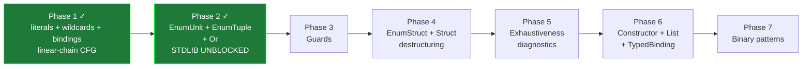

# Alpha Match Plan

Design + sequencing for `match` in the alpha pipeline.

`match` is the highest-priority stdlib blocker per
[ALPHA-ROADMAP.md](ALPHA-ROADMAP.md): every `Option`/`Result`-flavored stdlib
file (`kernel.expo`, `process.expo`, `list.expo`, `io.expo`, `fd.expo`,
`string.expo`) reaches for it. The good news is that **the AST is already
fully fleshed out** (`Pattern` enum, `MatchArm`, `ExprKind::Match`,
`Statement::Pattern`, `AssignTarget::Pattern`), the **spec is settled**
(LANGUAGE.md §632–701), and **v1 has a working reference implementation**
across `expo-typecheck/src/pattern.rs` and `expo-ir/src/{resolved,lower}/`.
The work is "transcribe + adapt to alpha conventions," not "design."

For the surface spec, see [LANGUAGE.md §Pattern Matching](../LANGUAGE.md).
For pipeline shape and seal contracts, see
[COMPILER-NORTHSTAR.md](COMPILER-NORTHSTAR.md).

---

## Status

- **Phase 1 — Shipped (May 2026).** Literal / wildcard / binding patterns
  over primitive subjects; required catch-all; value-producing join through
  the same merge-with-`BlockParam` shape `if`/`cond`/`ternary` use. Lowering
  emits the linear-chain CFG (one test block per gated arm, an unconditional
  branch for the catch-all). End-to-end coverage: typecheck
  (`expo-alpha-typecheck/tests/resolve_match.rs`), IR lowering
  (`expo-alpha-ir/tests/lower_match.rs`), interpreter
  (`expo-alpha-ir-eval/tests/interpreter.rs` `match_*` section), LLVM
  (`expo-alpha-ir-llvm/tests/control_flow.rs` `match_*` section).
- **Architectural change shipped alongside Phase 1.** Alpha IR seal moved
  from strict per-block SSA to dominance-based SSA. Cooper-Harvey-Kennedy
  immediate-dominator computation lives in
  `expo-alpha-ir/src/dominators.rs`; the seal walk in
  `expo-alpha-ir/src/seal/function.rs::seal_ssa` walks the dominator tree
  top-down threading a defined-value set, so a value defined in a
  dominating block is in scope for every dominated use without explicit
  threading. This is the SIL/LLVM model. The match subject lives in entry
  and is consumed in dominated test blocks unchanged — exactly the
  invariant the gated-CFG strategy expects for Phases 2+.
- **Phase 2 — Shipped (May 2026).** `EnumUnit`, `EnumTuple` (one-level —
  payload elements restricted to wildcard / binding), and `Or`
  (alternatives restricted to literal / EnumUnit, no bindings) over enum
  subjects. Structural exhaustiveness for enum subjects (catch-all
  optional when every variant is covered); primitives keep the strict
  catch-all rule. Two new IR instructions (`EnumTagGet`,
  `EnumPayloadFieldGet`) and one new terminator (`IRTerminator::Unreachable`)
  for the trap block synthesized on the failure edge of an exhaustive
  enum match. Per-arm `LocalScope::snapshot`/`restore` keeps pattern
  bindings arm-local. End-to-end coverage extends the same four match-
  named test sections Phase 1 set up: `resolve_match.rs`,
  `lower_match.rs`, `interpreter.rs`, `control_flow.rs`. Stdlib
  `Option`/`Result`/`Step`/`StopReason`/`Lifecycle` matches all execute
  end-to-end through both the interpreter and LLVM backends.
- **Phases 3–7 — Pending.**

---

## Spec recap

LANGUAGE.md pins these properties:

- Pattern shapes: literals (Int/Float/Bool/String), wildcards (`_`),
  variable bindings, nested patterns, enum/struct destructuring, `|`-joined
  or-patterns, guards via `when`, typed bindings (`p: Post`) for unions,
  binary patterns (`<<...>>`).
- **Or-patterns disallow variable bindings.** Hard syntactic rule.
- **`match` is value-producing when all arms produce values** — same join
  contract as `if`/`else`/`cond`.
- **`match` borrows; it does not consume.** The subject stays live in
  arms and after the expression.
- **Exhaustiveness is in the spec.** "Pattern matching with exhaustiveness
  checking."
- **LHS-`=` struct destructuring is "Planned Features."** _Not implemented
  in v1._ Alpha doesn't need to handle it.

---

## Stdlib pattern survey

Grepping `expo/lib/global/src/*.expo` (29 `match` arms across the stdlib)
narrows the actually-blocking pattern subset sharply:

- **Used**: `Pattern::EnumUnit` (`Option.None`, `StopReason.Normal`),
  `Pattern::EnumTuple` (`Option.Some(x)`, `Result.Ok(v)`, `Step.Continue(n)`),
  `Pattern::Literal` (string literals), `Pattern::Or` (string literals only),
  `Pattern::Wildcard`, `Pattern::Binding`.
- **Not used**: `Pattern::EnumStruct`, `Pattern::Struct`,
  `Pattern::Constructor` (shorthand `Some(x)` without enum prefix),
  `Pattern::TypedBinding`, `Pattern::List`, `Pattern::Binary`,
  guards (`when`), nested patterns deeper than `Option.Some(reply_to)`,
  numeric-literal patterns.

So the **stdlib-unblocking phase is small**: wildcard + binding + literal

- or + EnumUnit + EnumTuple. Everything else is post-stdlib polish.

---

## v1 audit — what to keep, what to rebuild

### v1 typecheck (`expo-typecheck/src/pattern.rs`, ~820 LOC)

A single file that implements the entire pattern spec. Largely
**transcribable as-is** into `expo-alpha-typecheck/src/pipeline/resolve/`:

- `check_pattern(pat, subject_type, ctx, env)` — recursive validator. Walks
  pattern structure, validates type compatibility, **inserts bindings into
  `env`** (alpha's equivalent is the `Resolver`'s scope stack).
- `check_match_exhaustiveness` — simple, name-based. For enums: collect
  matched variant names, compute missing, error on any. For unions: collect
  matched member type-names. Catch-all detection (`_`, bare ident, or
  or-pattern containing one) short-circuits the check. **No decision-tree
  machinery, no Maranget-style algorithm.** Good — the spec doesn't require
  it and the simple shape is what we want.
- Or-pattern binding rejection is enforced via `collect_pattern_bindings`
  returning non-empty → diagnostic.
- Generic-enum substitution flows through `resolve_variant_data` /
  `substitute_variant_data` / `build_substitution`. Alpha's
  `substitute_resolved_type` covers the equivalent surface; the helper
  shape needs porting.

**Adapt, don't fork**: alpha's resolver pattern is to split per-shape into
small files (`resolve/structs.rs`, `resolve/enums.rs`, `resolve/calls.rs`).
The transcription should produce `resolve/patterns.rs` + `resolve/match.rs`
following that convention, not a single 800-LOC file.

### v1 IR lowering (`expo-ir/src/{lower,resolved}/patterns*.rs`, ~2.1K LOC)

This is the big one, and the part where v1's nastiness shows. Two key
takeaways:

#### Keep: linear-arm-chain CFG

v1 lowers `match` as a **linear chain of arms with fallthrough** (not a
decision tree). Each arm is a sub-CFG that may expand to multiple blocks
for nested gating; on miss, every gated `CondBranch`'s failure edge points
to the **next arm's entry block** (or the `fallthrough_block` for the last
arm). Quoting the v1 module docs:

> `Some(TokenKind.Ident("and"))` produces three CondBranches (outer Some?
> inner Ident? literal "and"?), each branching directly to the same
> `failure_target` on miss. There is no per-arm "fail collector" block.

This shape is **directly compatible with alpha's existing block-parameter
SSA model**. The merge block declares one `BlockParam` typed by the
match's join type; each arm's body branches into the merge with its tail
value as the per-edge `BranchTarget::args` payload. Identical to `if`/`else`
and `cond`.

#### Keep: gated-CFG (failure-target threading)

The "failure_target threaded through every nested constructor pattern"
contract is the right design. It means payload projections only execute on
the success branch of their enclosing tag check — `Option.Some(x)` reads
`x` only when the tag-eq check passed, so unreachable-payload reads simply
don't happen. Mirror this in alpha.

#### Drop: separate IR pattern primitives

v1 introduced six pattern-specific IR instructions:

- `IRInstruction::PatternTagEq` — variant tag equality
- `IRInstruction::PatternLiteralEq` — literal equality
- `IRInstruction::PatternProjectVariantField` — extract field from payload
- `IRInstruction::PatternUnionPayloadPtr` — pointer-coerce union payload
- `IRInstruction::PatternBindFromPtr` — bind from pointer
- `IRInstruction::PatternBinaryMatch` — binary-pattern submachine

These exist because v1's IR is pointer-flavored (subject lives behind an
`IROperand::Local` pointer; pattern primitives all take `subject_ptr`).
Alpha is value-flavored — `LocalRead` produces a `ValueId`, `EnumConstruct`
produces a value, `FieldGet` projects a value field. Adopting the pointer-
based pattern primitives wholesale would force a representation switch we
don't need.

What we add instead:

- **`IRInstruction::EnumTagGet { dest, value, ty }`** — read the
  discriminant of an enum value as `IRType::Int8`. (Alpha currently has
  `EnumConstruct` but no inverse; this is the one structural addition.)
- **`IRInstruction::EnumPayloadFieldGet { dest, value, tag, payload_index, field_type, ty }`**
  — project a known variant's payload field. Behaves like `FieldGet` but
  carries the variant tag for seal-side validation (the projection is
  only well-defined when the runtime tag matches; the gated-CFG contract
  ensures it does).

Everything else lowers to combinators we already have:

- Tag-eq check = `EnumTagGet` + `Const(tag_byte)` + `BinaryOp::Eq`
- Literal-eq check (Int/Bool) = `Const` + `BinaryOp::Eq`
- Literal-eq check (String) = method-call to whatever `==` lowers to (the
  stdlib's `String.eq` runs through the `Equality` protocol). Same path
  as a surface `s == "foo"`.
- Bind = `LocalDecl` + `LocalWrite` of the projected value
- Or-pattern = chained `CondBranch`es in the gated CFG (no logical-or
  fusion needed — the CFG itself does the OR)

#### Drop: dual emission shape

v1 has two pattern-emission paths:

- `LoweredPattern` (flat instruction stream + i1) for `receive` arms and
  `expr matches Pattern`.
- `lower_pattern_into_arm` (gated CFG) for match arms.

Alpha doesn't have `expr matches Pattern` yet, and `receive` is far enough
out that we shouldn't pre-pay for it. Keep one shape: **gated CFG only**.
When `receive` lands, it can reuse the same shape (a one-arm match-like
construct) — exactly the same ergonomics LANGUAGE.md describes.

#### Drop: `ResolvedMatchType::UnionWrap`

v1 carries a `Direct` vs `UnionWrap` strategy on the resolved match type
to handle heterogeneous arms wrapped in the surrounding fn's union return.
Alpha doesn't have unions yet (per ALPHA-ROADMAP.md they come with
binary/concat/string-builder support), so `UnionWrap` is dead surface
today. Implement only `Direct` — the same model `if`/`else`'s
`join_two_arms` already uses. Add `UnionWrap` when union types arrive.

---

## The four open questions, answered

1. **CFG strategy** — Linear-chain-of-arms-with-fallthrough, gated CFG for
   nested patterns. Maps cleanly onto alpha's existing
   block-parameter / `BranchTarget` model.

2. **Binding scope** — Each pattern variable mints a fresh
   `LocalId` / `IRLocalId` and a `LocalDecl` in the entry block, with a
   `LocalWrite` from the projected value at the point in the gated CFG
   where the bind becomes live. The resolver scope stack handles
   per-arm visibility (alpha already does this for `for`-loop bindings).
   Or-patterns: spec disallows bindings, so no compatibility check needed.

3. **Exhaustiveness** — Yes, check it. Use v1's name-list approach: gather
   matched variant / member names, compute missing against the type's
   declared roster. Catch-all (wildcard / binding / or-with-catchall)
   short-circuits. No decision-tree algorithm needed for the spec.

4. **Guards in or-patterns** — The combination is legal (or-patterns are
   bindless, guards run after the pattern matches), but alpha can defer
   it: stdlib has zero guarded matches and zero guards on or-patterns.
   Phase 3 adds plain guards; the or-pattern × guard interaction is one
   line in the lowering (the guard's `BoolAnd`-fused i1 is the
   already-fused or-pattern's check result).

---

## Phasing

The phases are sliced by **pattern complexity**, not by container
(LHS-`=` doesn't apply). Each phase ships its own PR and is independently
testable end-to-end (typecheck → IR → eval → LLVM).

### Phase 1 — Skeleton (literals + wildcards + bindings) ✓

Shipped. Subject is any primitive type; arms are literal patterns
(Int/Bool/String), wildcards, or ident-bindings. Required catch-all
(no exhaustiveness for primitives — every match needs a wildcard or
binding terminal arm).

- **AST.** `Pattern::Binding` carries an `Option<LocalId>` slot the
  resolver stamps (mirroring `Param::Regular` / `ExprKind::Self_`).
  Pattern label + span helpers live in `expo-ast/src/labels.rs`.
- **Seal (typecheck).** `expo-alpha-typecheck/src/pipeline/seal.rs`
  walks the match subject + every arm pattern + arm body.
  `seal_pattern` is the new leaf-recursive helper.
- **Resolve.** `expo-alpha-typecheck/src/pipeline/resolve/match_expr.rs`
  + `resolve/patterns.rs`. Subject and arm bodies resolve unchanged;
  arm tails join through the same `join_arm_tails` helper
  `if`/`cond`/`ternary` already use (visibility was lifted to
  `pub(super)`). Guards and any non-Phase-1 pattern shape diagnose
  as `feature gap` errors.
- **Substitute.** `ExprKind::Match` was pulled out of the no-op list
  in `expo-alpha-ir/src/generics/substitute.rs`; subject + arm bodies
  walk for type substitution. Pattern nodes carry no `ResolvedType`
  slot in Phase 1 so the pattern walk is a no-op there.
- **IR lower.** `expo-alpha-ir/src/lower/match_expr.rs` +
  `lower/patterns.rs`. The subject lowers once into the entry block;
  patterns translate to a `PatternCheck` enum (`CatchAll` |
  `Predicate { value }`); the CFG is a linear chain — one
  `match_test_*` block per gated arm with the predicate as its
  `CondBranch.cond`, an unconditional branch into the body for a
  catch-all, every body branching into a single `match_merge` block
  with one `BlockParam` typed by the join. Binding patterns emit
  `LocalDecl` + `LocalWrite` of the subject `ValueId` so existing
  local-slot lowering handles reads. The shared
  `coerce_arm_value` / `emit_unit` / `lower_result_ty` helpers were
  lifted into `expo-alpha-ir/src/lower/arms.rs` and are reused by
  `if`/`cond`/`ternary` and now `match`.
- **String equality** got real LLVM lowering: `BinaryOp::Eq` on
  `IRType::String` lowers to `strcmp(a, b) == 0`. Eval's value-equality
  already handled it; the typecheck path admits `String == String`
  through the existing `Equality` protocol.
- **Eval.** No interpreter changes — match lowers to existing
  CondBranch / Branch / BlockParam / LocalDecl / LocalWrite primitives
  the eval dispatcher already handles.
- **LLVM.** No emitter changes for the same reason; the match-shape
  test in `tests/control_flow.rs` pins `match_test_*` /
  `match_body_*` / `match_merge` labels, the `icmp eq i64` predicate,
  the `@strcmp` + `icmp eq i32` shape for string arms, and the
  `alloca` / `store` / `load` chain for binding arms.
- **Architecture.** The seal pass moved to dominance-based SSA in this
  same slice. The match subject lives in the entry block and is read
  in dominated test blocks; under the strict per-block model that
  required threading the subject through every test block's
  `BlockParam`, which is the textbook reason mainstream IRs use
  dominance instead. See the Status section above.

### Phase 2 — Enum patterns (`EnumUnit` + `EnumTuple`) + or-patterns ✓

The stdlib-unblocking slice. Shipped May 2026.

- **AST.** No changes — `Pattern::EnumUnit`, `Pattern::EnumTuple`, and
  `Pattern::Or` were already wired up.
- **IR.** `IRInstruction::EnumTagGet { dest, value, ty }` and
  `IRInstruction::EnumPayloadFieldGet { dest, value, tag, payload_index, field_type, ty }`
  in `expo-alpha-ir/src/function.rs`. Seal coverage in
  `expo-alpha-ir/src/seal/enums.rs` validates `tag` is in range,
  `payload_index` is in the matched variant's payload, and `field_type`
  matches the decl. `IRTerminator::Unreachable` joins
  `Branch` / `CondBranch` / `Return` on the terminator side; lowering
  emits it on the failure edge of an exhaustive enum match. The seal's
  successor / arity walks accept it as an exit terminator.
- **Resolve.** `expo-alpha-typecheck/src/pipeline/resolve/patterns.rs`
  grew per-shape helpers: `resolve_enum_unit_pattern`,
  `resolve_enum_tuple_pattern`, `resolve_or_pattern`. Each returns a
  `PatternCoverage` (`CatchAll` / `Variants(Vec<u32>)` / `Other`) so
  `resolve_match.rs` can run a structural exhaustiveness check on enum
  subjects without re-walking the arm. Generic-payload substitution
  flows through the existing `substitute_resolved_type`. Tuple elements
  restricted to wildcard / binding; or-alternatives restricted to
  literal / EnumUnit (no bindings).
- **Per-arm scope.** `LocalScope::snapshot`/`restore` in
  `expo-alpha-typecheck/src/pipeline/local_scope.rs` mints a fresh
  scope for each arm body and unwinds pattern bindings on exit, so two
  consecutive arms binding `x` get distinct `LocalId`s.
- **Exhaustiveness.** `resolve_match.rs` keeps the strict catch-all
  rule for primitives but relaxes it for enums to a structural
  variant-coverage check; missing variants surface as a diagnostic
  listing every uncovered name.
- **Seal walk.** `seal_pattern` in
  `expo-alpha-typecheck/src/pipeline/seal.rs` recurses into `EnumTuple`
  elements, `Or` alternatives, and the enum-path metadata.
- **IR lowering.** `expo-alpha-ir/src/lower/patterns.rs` gained a
  `PatternCheck::Tests { steps, payload_binds }` variant alongside the
  existing `CatchAll`. A single test step covers `Literal` / `EnumUnit` /
  `EnumTuple`; `Or` produces a chain of steps via fresh
  `match_or_alt_<n>` blocks. `EnumUnit` and `EnumTuple` emit
  `EnumTagGet` + `Const(Int8)` + `BinaryOp::Eq`; tuple bindings build a
  `PayloadBind` list the driver emits as `EnumPayloadFieldGet` +
  `LocalWrite` at the head of the body block (success edge only).
- **IR match driver.** `expo-alpha-ir/src/lower/match_expr.rs` now
  iterates the test chain when wiring an arm: every interior step's
  failure edge points to the next step, the last step's failure edge
  goes to the next arm's first test block (or, when there is no next
  arm, a synthesized `match_unreachable` trap block whose terminator
  is `IRTerminator::Unreachable`). The trap block is lazily minted
  once per match and shared across every exhausted-edge in the same
  match.
- **Eval.** `expo-alpha-ir-eval/src/interpreter.rs` interprets
  `EnumTagGet` directly off the runtime `Value::Enum.tag` and
  `EnumPayloadFieldGet` off the matching variant's `EnumPayload`.
  Tag-mismatch on a payload-field-get panics (gated-CFG invariant
  violation). Reaching `IRTerminator::Unreachable` raises
  `RuntimeError::UnreachableExecuted`.
- **LLVM.** `expo-alpha-ir-llvm/src/emit/instruction.rs` spills the
  SSA enum to a fresh outer-typed alloca, GEPs through the variant's
  `complete` struct (field 0 for the tag, field 2 then payload-struct
  field-N for payload reads), and loads as `i8` / `field_type`
  respectively. The `Unreachable` terminator emits LLVM's `unreachable`
  instruction.
- **Const seal.** `ConstValue::Int8` is now admitted by the const-seal
  walk so the tag-eq const can land.

After this phase, `Option`/`Result`/`Step`/`StopReason`/`Lifecycle` matches
all execute end-to-end through both backends; the remaining gaps in the
stdlib are unrelated alpha typecheck work (function-typed annotations,
type-arg inference from payload patterns, multi-file imports — see
ALPHA-ROADMAP.md).

### Phase 3 — Guards

Surface: `pattern when expr -> body`.

- Resolve: `expr` checks against `Bool` in the post-pattern-bind scope
  (the guard sees pattern-introduced locals).
- Lower: append the guard's lowered i1 to the arm's check sub-CFG;
  `BoolAnd`-fuse with the pattern's success i1; that combined value is
  the cond for the body branch. Failure path is the existing failure
  target (the guard isn't a separate arm; a guard miss falls to the
  next arm just like a pattern miss).

Stdlib doesn't use guards, but spec parity requires them and they're a
small phase.

### Phase 4 — Struct destructuring (`EnumStruct` + `Struct`)

Surface: `Shape.Rect{width: w, height: h}`, `Point{x, y}`.

- v1's `check_struct_field_patterns` is the reference. Field-name lookup
  against the variant payload / struct decl, recursive `check_pattern`
  per field. Unlisted fields are implicit wildcards (no projection
  emitted).
- Lower reuses `EnumPayloadFieldGet` (for variant-struct) and `FieldGet`
  (for plain struct). Same gated-CFG shape, just one branch per field.

Stdlib doesn't use these, but they're a clean follow-up to enum patterns
and complete the "destructuring" story.

### Phase 5 — Exhaustiveness diagnostics

Surface: missing-variant / missing-member errors.

- Direct port of v1's `check_match_exhaustiveness`. Catch-all detection
  via `pattern_is_catch_all`. Variant-name list per enum; member-name
  list per union. Missing → diagnostic with hint.
- Today, missing arms fall through to `fallthrough_block` and `panic` at
  runtime. Lifting it to a typecheck error is the quality bar.
- Defer until after stdlib compiles, so the stdlib's matches are run
  through the full check at the same time as everything else.

### Phase 6 — Remaining pattern shapes

`Constructor` (shorthand `Some(x)`), `List`, `TypedBinding` (union
narrowing). `Constructor` becomes a small adapter that resolves the
shorthand to a full `EnumTuple`/`EnumUnit`. `List` and `TypedBinding`
are post-stdlib polish.

### Phase 7 — Binary patterns

`<<header::8, payload::16 big>>`. The payload here is the
`Pattern::Binary` plus the `BinarySegment` machinery v1 already has. This
is a discrete sub-language — independent typecheck (`check_binary_pattern`,
greedy-rest validation, byte-alignment checks) and independent lowering
(stays as its own IR primitive, since binary inspection doesn't decompose
into primitive ops). Stdlib doesn't reach for it — defer indefinitely.

---

## Build/code-quality notes

Per [build.mdc](../../.cursor/rules/build.mdc):

- Phase 1 landed `resolve/patterns.rs` and `lower/patterns.rs` as single
  files (small enough not to warrant subdirectories yet). When Phase 2
  introduces enum-shaped patterns and the file pushes against the
  function-size guidance, split per shape into a `patterns/` directory
  rather than re-creating v1's monolithic `pattern.rs` /
  1.9K-line `lower/patterns.rs`.
- Bundle multi-arg lowering helpers with `*Lowering<'a>` structs the way
  `IfLowering` / `CondLowering` / `TernaryLowering` /
  `MatchLowering` already do. Keep `lower_match_arm`-shaped helpers
  under the `too_many_arguments` threshold.
- New IR instructions (`EnumTagGet`, `EnumPayloadFieldGet`) need
  per-instruction seal coverage and per-instruction eval + LLVM
  handlers. Tests pin shape, not byte-exact LLVM IR.
- The dominance-based SSA seal admits the match subject in test blocks
  for free, but Phase 2's payload projections (`EnumPayloadFieldGet`
  on a successful tag check) still want gated CFG: the projection only
  executes on the success branch of the tag-eq check, so a
  failed-projection's value never enters scope. This is a correctness
  property, not a seal property.

## Surface area summary

| Phase | New IR                                                       | New typecheck                                                          | Stdlib unblocks                  | Status      |
| ----- | ------------------------------------------------------------ | ---------------------------------------------------------------------- | -------------------------------- | ----------- |
| 1     | (none, but seal moved to dominance)                          | `match` resolve, literal/wildcard/bind patterns                        | (none)                           | **Shipped** |
| 2     | `EnumTagGet`, `EnumPayloadFieldGet`, terminator `Unreachable` | enum patterns + or, structural enum exhaustiveness, per-arm scope unwind | **all `Option`/`Result` stdlib** | **Shipped** |
| 3     | (none)                                                       | guard typing                                                           | (none — spec parity)             | Pending     |
| 4     | (none)                                                       | struct/enum-struct field patterns                                      | (none — surface polish)          | Pending     |
| 5     | (none)                                                       | exhaustiveness check (full diagnostics)                                | (quality bar)                    | Pending     |
| 6     | (none)                                                       | shorthand `Constructor`, `List`, `TypedBinding`                        | (post-stdlib)                    | Pending     |
| 7     | binary submachine                                            | `check_binary_pattern`                                                 | (post-stdlib)                    | Pending     |

The work is real but the IR surface adds up to two new value
instructions, one new terminator, and the relaxed-catch-all rule.
Everything else is reuse of the block-parameter SSA join model + the
constructor pass + existing seal machinery.
