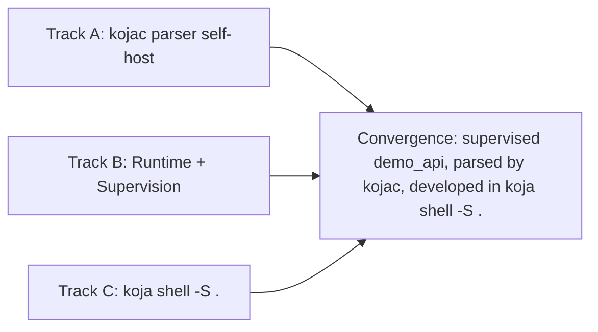
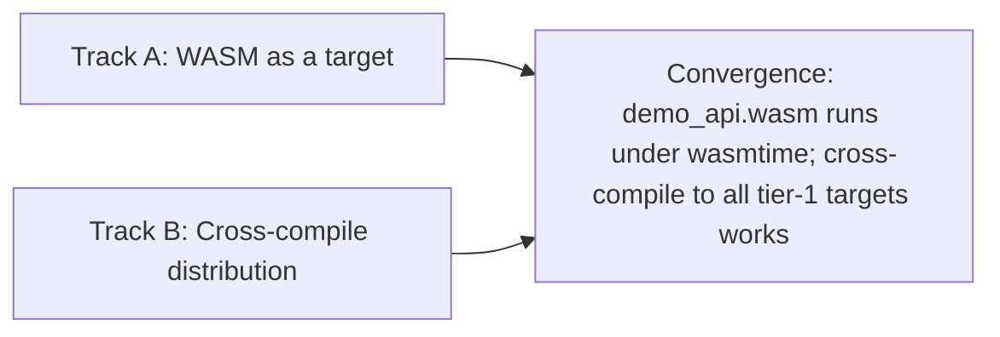

# Koja Language Roadmap

Solo developer + AI assistance. Bootstrap in Rust, self-host in Koja.

---

## Current state

### Compiler

A 15-crate Rust workspace built around the four-phase sealed pipeline described in [COMPILER-NORTHSTAR.md](COMPILER-NORTHSTAR.md): `koja-parser → koja-typecheck → koja-ir → koja-ir-llvm` / `koja-ir-eval`. The typecheck phase populates `Resolution` and `resolved_type` annotations on the AST and asserts via `seal_ast`; the IR phase consumes the sealed AST and produces a sealed `IRProgram` asserted by `seal_program`; both backends consume the same sealed `IRProgram` as siblings.

Pipeline crates:

- `koja-lexer` -- custom tokenizer (implementation detail of `koja-parser`, not a phase boundary)
- `koja-parser` -- recursive descent parser (Pratt precedence for expressions); produces raw AST
- `koja-typecheck` -- semantic analysis: cfg-strip, collect, synthesize default impls, resolve, check, annotate, seal
- `koja-ir` -- lowers sealed AST into a sealed `IRProgram` (per-package source lowering, whole-program closure pass for monomorphization, coercion emission)
- `koja-ir-llvm` -- LLVM IR generation via `inkwell` (native binary backend)
- `koja-ir-eval` -- tree-walking interpreter over the sealed `IRProgram` (powers `koja eval`, `koja shell`, and the REPL evaluator)

Shared substrate:

- `koja-ast` -- tokens, spans, AST node definitions, `Resolution`/`Identifier` shapes, `seal_ast`
- `koja-runtime` -- multi-threaded process scheduler and C-ABI intrinsics (static library linked into compiled binaries)
- `koja-stdlib` -- build script auto-discovers `.koja` sources under `expo/lib/` and embeds them via `include_str!`

Tooling:

- `koja-fmt` -- opinionated code formatter
- `koja-doc` -- HTML documentation generator (askama templates, pulldown-cmark)
- `koja-test` -- test runner library (`@test` discovery, harness generation)
- `koja-shell` -- interactive REPL (rustyline-driven; runs the four-phase pipeline per input and evaluates via `koja-ir-eval`)
- `koja-lsp` -- language server (diagnostics, formatting, hover with inferred types, go-to-definition, AST-based dot completion and signature help)

Driver:

- `koja-driver` -- CLI binary (`koja`); builds BoringSSL via `boring-sys` and embeds `libcrypto.a` for `@link "crypto"` resolution

### CLI

Eleven commands: `koja new`, `koja build`, `koja run`, `koja check`, `koja eval`, `koja shell`, `koja test`, `koja format`, `koja doc`, `koja lex`, `koja parse`.

Source-shape rule: `.koja` files are project files (multi-module, declarations only); `.kojs` files are scripts (top-level expressions and statements, no `fn main`); omitting the file argument resolves the project via `koja.toml`. Project mode runs the full pipeline through `koja-ir-llvm::compile_program`; script mode lowers a synthetic entry point and (by default) evaluates via `koja-ir-eval`.

Backend selection: `run` and `build` accept `--backend={interpreter,llvm}`. `run` defaults to `interpreter` (millisecond startup, prints the trailing value, exits 0); `build` defaults to `llvm` and rejects `interpreter` since the interpreter does not produce a binary. `koja eval` is a thin alias for `koja run --backend=interpreter`. `koja shell` always uses the interpreter.

Additional flags: `--release` on `run`/`build` (LLVM aggressive optimizations), `--emit-llvm` on `build` (print LLVM IR to stdout), `--emit-ast` on `parse` (raw AST) and `check` (sealed AST). See the per-phase emit conventions in [COMPILER-NORTHSTAR.md](COMPILER-NORTHSTAR.md).

### What runs today

Both backends share the same feature surface by design -- they consume the same sealed `IRProgram` and follow the same "one emission pattern per `IRInstruction`" rule. The LLVM backend produces native binaries; the interpreter runs the IR directly for `koja eval`, `koja shell`, and `koja run --backend=interpreter` (the new default for `run`).

- Multi-module imports (including qualified calls like `math.add()`)
- Functions (`fn`/`priv fn`)
- Constants (`const`) with optional type annotations (`const NAME: Type = expr`), including enum unit variants and struct literals with all-constant fields
- Structs
- Enums
- Impl blocks and methods (`self`)
- Generic functions with monomorphization
- Generic structs with monomorphization
- Generic enums with monomorphization
- Variable type annotations (`x: Int32 = 42`, `z: Option<Int32> = Option.None`)
- Numeric type coercion for annotated variables (`x: UInt8 = 4` casts at compile time)
- `if`/`else`
- `unless`
- `while`
- `loop` and `break`
- `return`
- `match`
- `cond`
- Ternary (`? :`)
- Compound assignment (`+=`, `-=`, `*=`, `/=`) on variables and struct fields (e.g., `self.pos += 1`)
- String interpolation
- Protocols (`protocol` keyword, `impl Protocol for Type` conformance)
- Closures (block form, with variable capture -- copy for primitives, move for structs/enums)
- Function type syntax (`fn(T) -> U`) for closure-accepting parameters
- `print` builtin (dispatches through `Debug.format()` for all types)
- `panic` builtin (prints to stderr, aborts)
- Lightweight processes -- structs implement `Process<C, M, R>` protocol. `spawn T.start(config)` creates a process and returns `Ref<M, R>`. `receive` blocks for messages with optional `after timeout` clause. Message type `M` can be any type (primitives, structs, enums). Backed by `koja-runtime` cooperative scheduler.
- **`Task<R>`** -- `Task.async(fn () -> R)` / `Task.await` for one-off async work on top of processes (`Ref<(), R>` + `call`); see `lib/global/src/kernel.koja` and `tests/lang/task.koja`.
- Primitives: `Int`, `Int8`, `Int16`, `Int32`, `UInt8`, `UInt16`, `UInt32`, `UInt64`, `Float`, `Float32`, `Bool`, `String`
- List literal syntax (`[1, 2, 3]`) backed by `ListLiteral<T>` protocol
- Map literal syntax (`["key": value]`, `[:]` empty) backed by `MapLiteral<K, V>` protocol
- `Self` type expression in `protocol` and `impl` blocks
- `Hash` and `Equality` protocols with intrinsic implementations for all primitives
- Stdlib types: `Option<T>`, `Result<T, E>`, `Pair<A, B>`, `Map<K, V>`, `Set<T>` (auto-imported from the `Global` package's `kernel.koja`); `Process<C, M, R>`, `Ref<M, R>`, `ReplyTo<R>`, `Task<R>`, `Step<S>`, `Lifecycle`, `StopReason`, `ExitStatus`, `ExitReason` (auto-imported from `process.koja`); `CPtr<T>`, `CString` (auto-imported from `cptr.koja`, `cstring.koja`)
- `List<T>` iterator functions (`map`, `filter`, `any?`, `all?`) implemented as pure Koja code in `lib/global/src/kernel.koja`
- Bare function names as references (`f = double; f(5)`, `list.map(double)`) -- top-level functions produce closure-compatible fat pointers via thunk wrappers
- Union types (`A | B | C`) -- anonymous tagged unions with widening coercion, exhaustiveness checking, and `match` support with typed binding patterns (`p: Post -> p.title`)
- Named union aliases (`type FeedItem = Post | Comment | Ad`) -- `type` keyword declarations resolved in the type context
- Trait bounds on generic type parameters (`<T: Protocol>`, `<T: Proto1 & Proto2>`) -- bounds verified at call sites, protocol method resolution on bounded type vars in function bodies, `&` as protocol composition operator
- `alias` keyword for file-private package type shorthands (`alias JSON.Decoder`, `alias JSON.Decoder as JSONDecoder`) -- qualified type resolution via `package.Type` syntax
- C FFI Phase 1 (primitives) and Phase 2 (pointers and strings): `@extern "C"` and `@link "libname"` annotations for calling C functions. `CPtr<T>` raw pointer type (`Copy`, backed by `malloc`/`free`). `CString` null-terminated string type with `String.to_cstring()` and `CString.to_string()` conversions. `CPtr<T>` accepted in `@extern "C"` signatures for pointer-passing FFI.

### Design notes

- **No tuples**: Koja does not have anonymous tuple syntax. `(a, b)` is grouping only. For multiple return values, use a struct. `Pair<A, B>` (with `.first` / `.second`) is available in the stdlib for lightweight two-value cases. 3+ values should always be a struct. Note: `(a, b)` pair syntax may return once protocols land via a `PairLiteral<A, B>` literal protocol -- this would be protocol-backed syntax, not a built-in tuple type, and is limited to arity 2.
- **`()` as the unit literal**: `()` is the literal whose type is the 0-tuple -- Koja's "no useful value" type. Use `else -> ()` in `cond` for side-effect-only fallthrough. Function bodies whose declared return is the 0-tuple implicitly coerce the trailing value to unit (kept for stdlib ergonomics; the interpreter applies the coercion via `coerce_return` in `koja-ir-eval`). Pre-1.0 cleanup: tighten the typechecker to require explicit return-type annotations rather than relying on implicit coercion, and consider renaming the type itself to `Unit` (or `Void`) so it sits visually alongside `Int`/`String`. 1-tuples are not and never will be a thing.
- **Closures**: Block closures with explicit types and parens: `fn (a: Int32, b: Int32) -> Int32 ... end`. Mirrors function signature syntax. Short closures (`x -> expr`) with full capture support and context-driven parameter type inference at inline call sites. Used by `map`/`then` on `Option` and `Result`.
- **No private modules**: Files are modules, and all modules are importable. Access control lives at the function level (`priv fn`), not the module level. Use `@doc false` on types to signal "internal, don't depend on this" -- a documentation-level convention, not a compiler wall. This matches Elixir's approach and avoids the complexity of Rust's `pub(crate)` or Go's `internal/` directory enforcement.
- **PascalCase primitives and type simplification** (done): Primitives renamed from `i32`/`i64`/`f32`/`f64`/`bool`/`string` to PascalCase: `Int` (64-bit default), `Int32`, `Float` (64-bit IEEE default), `Float32`, `Bool`, `String`. User-defined types (`Pair`, `User`) and language types (`Int`, `String`) are now visually uniform. `Decimal` will ship in the stdlib as an exact-arithmetic type for financial/business logic, sitting alongside the primitives with no visual distinction.
- **`ref T` syntax** (parsed, deferred): Reference types use `ref T` (space, no angle brackets) instead of `ref<T>`. `ref` is a lowercase keyword modifier, consistent with the modifier pattern (`const`, `priv`, `move`, `ref`): lowercase keywords modify the thing that follows them, PascalCase names are always types. However, `ref T` is redundant in parameter position (borrow-by-default) and unsafe in return position without lifetime tracking. Deferred until a concrete use case emerges.
- **Map literal syntax** (decided): `[key: value, key: value]` with `[:]` for empty maps. Maps are collections (like `List<T>`), not struct-like, so they share the bracket family rather than curly braces. The parser disambiguates list vs. map by peeking for `:` after the first expression. Curly braces remain exclusive to struct construction (`Config{name: "yo"}`).
- **Subscript syntax** (deferred): `map["key"]` / `list[0]` as sugar for `.get()`. Would be backed by a protocol (e.g., `Subscript<K, V>`). Not needed yet -- method access (`map.get(key)`, `list.get(0)`) works. Can be added later without grammar conflicts since `[` after an expression is a different parse context than `[` at expression start.
- **Planned: Irrefutable struct destructuring**: `Config{name, port} = load_config()` as syntactic sugar for pulling struct fields into local variables. Compile-time verified exhaustive -- only works for structs (single shape), not enums. Enum destructuring uses `match`.

### Known gaps

See [GAPS.md](GAPS.md) for known compiler limitations and workarounds.

### Design artifacts

- **Language design** -- syntax decisions, memory model, async model, module system, all finalized through iterative design sessions
- **EBNF grammar** -- `grammar.ebnf`, ~460 lines covering all syntax constructs
- **Example codebase** -- 17 `.koja` files porting `auth-manager` (a real Rust microservice) into Koja pseudocode, validating the language feels right
- **Memory strategy** -- documented in `archive/20260323-MEMORY.md` (stack, ownership+move, explicit arena)
- **Concurrency model** -- documented in `archive/20260313-CONCURRENCY.md` and `archive/20260323-CONCURRENCY.md` (processes, native runtime, supervision)
- **Project config format** -- `koja.toml` (TOML-based, replacing `project.koja`)
- **Module system redesign** -- documented in `archive/20260403-IMPORT.md` (files as transparent, types as namespaces, no intra-project imports, qualified package access, `import` keyword removed)
- **Compiler architecture** -- destination spec in [COMPILER-NORTHSTAR.md](COMPILER-NORTHSTAR.md) (four-phase linear pipeline, sealed `IRProgram`, package-granular incremental, single `TypeIdentifier` for all bound names). Predecessor docs: [archive/20260502-EXPOIR-ROADMAP.md](archive/20260502-EXPOIR-ROADMAP.md) (live KojaIR roadmap), [archive/20260502-COMPILER.md](archive/20260502-COMPILER.md) (earlier self-hosted compiler sketch), and [archive/20260427-EXPOIR.md](archive/20260427-EXPOIR.md) (original SIL-style design and Wave 1-17 history).

### Tooling (pulled forward)

- **Project scaffolding** -- `koja new <name>` creates a project directory with `koja.toml` and `src/main.koja`
- **Formatter** -- `koja format --write` / `--check`, opinionated and zero-config, handles escape re-encoding for round-trip correctness, preserves annotations (including multiple annotations per declaration -- stacked or inline)
- **LSP** -- `koja-lsp` binary providing real-time diagnostics, document formatting, hover (Markdown-rendered type signatures + `@doc` + inferred variable types), go-to-definition (including qualified module calls), AST-based dot completion, and signature help over stdio, integrated with the VSCode/Cursor extension
- **VSCode extension** -- syntax highlighting and LSP client for `.koja` files
- **Vim plugin** -- syntax highlighting, auto-indentation (`indentexpr`), `matchit` block matching (`fn`/`end`, `if`/`end`), and `:make` compiler integration with `koja check` and `errorformat` for quickfix
- **DWARF debug info** -- always-on source-level debug metadata. Every function and statement carries file/line/column metadata. `.dSYM` bundles generated on macOS. Enables debugger attachment and runtime stacktraces.
- **Runtime stacktraces** -- Elixir-style panic output with `(appname)`/`(stdlib)` frame labels, relative paths, demangled function names, generic parameter stripping, ANSI color (respects `NO_COLOR`), and contextual hints for known panic patterns

### Build history

Phase 1 (bootstrap compiler) and Phase 2 (core language) are complete. Phase 3 (language surface + runtime maturity) is complete. Phase 4 (stdlib + ecosystem; runtime + reliability) is complete. The full build history with detailed implementation notes is preserved in [archive/20260318-ROADMAP.md](archive/20260318-ROADMAP.md), [archive/20260330-ROADMAP.md](archive/20260330-ROADMAP.md), and [archive/20260518-ROADMAP.md](archive/20260518-ROADMAP.md). Phase 5 is in progress; it introduces a new top-level `kojac/` subproject (sibling to `crates/`, `lib/`, `tests/`, `examples/`) housing the Koja-written self-host pipeline, starting with the parser.

---

## Phase 3: Language surface + Runtime maturity -- done

Phase 3 made the language real on two fronts: language surface (Track A) and runtime maturity (Track B). Both tracks are complete.

### Track A: Language surface -- done

Binary/bitstring system (A1a-A1e), string stdlib and type conversions (A2a-A2c), file I/O (A3a), project system (A3b), and the self-hosted lexer validation milestone (A4). Ranges (A2d) deferred -- not blocking.

### Track B: Runtime maturity -- done

Union types (B1), protocol-based process model with `Process<C, M, R>`, `Ref<M, R>`, `cast`/`call`, default protocol implementations, `receive...after` (B2), and `Task` (B3).

### Key decisions (Phase 3)

| Decision           | Recommendation                                                                                                                                                                                                                                                                                                                                            |
| ------------------ | --------------------------------------------------------------------------------------------------------------------------------------------------------------------------------------------------------------------------------------------------------------------------------------------------------------------------------------------------------- |
| Distinct types     | `String`, `Binary`, and `Bits` are three distinct types with no subtype relationships. Explicit conversion between them: widening always succeeds (zero-cost), narrowing validates and returns `Result`. See `archive/20260323-BITSTRINGS.md`.                                                                                                            |
| No Char            | No dedicated character type. Single-codepoint `String` values serve the same purpose -- fractal design. String ranges (`"a".."z"`) and classification methods (`is_alpha?()`) work on String directly.                                                                                                                                                    |
| Inclusive ranges   | One range operator (`..`), always inclusive on both ends. Pattern matching is the primary use case; numeric loops are rare in idiomatic Koja. `0..n-1` for the occasional exclusive case.                                                                                                                                                                 |
| Erlang defaults    | Binary segments default to unsigned big-endian (network byte order). Matches Erlang and covers the primary use case: HTTP microservices and network protocol parsing.                                                                                                                                                                                     |
| Bitwise protocol   | Bitwise operations are methods (`band`, `bor`, `bxor`, `bnot`, `bsl`, `bsr`) on a `Bitwise` protocol, not symbol operators. Frees `<<`/`>>` for binary literals and `&`/`\|`/`^` for other uses.                                                                                                                                                          |
| One primitive      | Processes are the sole concurrency primitive. `Task` is a kernel struct built on `Process<C, M, R>`, not a separate primitive. GenServer-like actor patterns are the `Process` protocol itself.                                                                                                                                                           |
| Process protocol   | `Process<C, M, R>` with three type params. Config (C) separates public args from private state via `start`. `start` runs in the child process context, returns `Result<Self, StopReason>`. Handlers return `Step<Self>` for explicit control flow. Fixed reply type (R) per process -- same as a service contract. Union types for heterogeneous replies. |
| Scheduler protocol | Define the runtime as a protocol interface before implementing any backend. The native scheduler is the first implementation, not a special case. Enables WASM targets, test runtimes, and third-party custom runtimes without changing user code.                                                                                                        |
| Native runtime     | A runtime library linked into the binary, not a VM. No bytecode, no GC. Similar to Go's runtime or Tokio, but with process lifecycle management.                                                                                                                                                                                                          |
| Typed mailboxes    | Processes declare message type M via protocol impl. `send` and `receive` are type-checked at compile time. Union types enable multi-source mailboxes (e.g., `PoolCmd \| ExitSignal`).                                                                                                                                                                     |
| Validation target  | The lexer port (A4) validated the language surface without requiring external dependencies (no network, no database, no JSON). The Rust compiler remains authoritative; the Koja lexer is compiled by it. ✓ Complete -- token output matches the Rust lexer.                                                                                              |

For detailed sub-milestone breakdowns (A1a-A1e, A2a-A2c, A3a-A3b, A4, B1-B3), see [archive/20260330-ROADMAP.md](archive/20260330-ROADMAP.md).

---

## Phase 4: Stdlib + Ecosystem / Runtime + Reliability -- done

Phase 4 made Koja useful for real programs (Track A) and concurrency production-grade (Track B). Both tracks landed; the convergence point (an HTTP service composed from stdlib primitives running on the production scheduler) is hit by `examples/demo_api`.

### Track A: Stdlib + Ecosystem -- done

- **Test runner** -- `koja test` discovers `@test`-annotated functions, generates a synthetic harness, compiles and runs.
- **Stdlib (`Global`)** -- `Fd`, `File`, `IO`, `Process`, `Debug`, `System`, `DateTime` / `Duration`, `Random`.
- **Stdlib packages** -- `Net` (POSIX socket surface: `TCPSocket`, `TCPListener`, `UDPSocket`), `HTTP` (vocabulary types + HTTP/1.1 `Parser` + one-shot `Client`; server composed by users from `Net.TCPListener` + `HTTP.Parser` + `response.serialize()` -- a packaged `HTTP.Server` wrapper deferred), `JSON` (Value / Encoder / Decoder / StringBuilder), `Crypto` (SHA family + HMAC via BoringSSL FFI, `libcrypto.a` embedded zero-setup).
- **Package manager** -- `[dependencies]` table with local-path support; `alias` keyword for file-private qualified-package shorthands.
- **C FFI Phase 1-2** -- `@extern "C"`, `@link "libname"`, `CPtr<T>`, `CString` interop.
- **Convergence** -- `examples/demo_api` is a real HTTP service built end-to-end on `Net` + `HTTP` + `JSON` + `Process` + signal-driven lifecycle.

### Track B: Runtime + Reliability -- done

- **Multi-threaded scheduler** -- round-robin over N worker OS threads sharing a `Mutex`-protected process list; per-worker thread-local state for `CURRENT_PID`, `SCHED_SP`, `YIELD_SP`.
- **Container-aware thread count** -- reads cgroup v2 CPU quota on Linux; falls back to `available_parallelism` on macOS and bare-metal Linux.
- **Idle thread parking** -- workers park on a `Condvar` when no work is available; woken by `send`, `spawn`, or deadline expiry.
- **Graceful shutdown** -- `AtomicBool` shutdown flag set when PID 1 dies; all workers exit and join. Deadlock detection for all-blocked-without-timeout scenarios.
- **I/O reactor** -- non-blocking socket I/O via the `polling` crate (kqueue on macOS, epoll on Linux). Dedicated reactor thread; covers `accept`, `connect`, `recv_from`, `send_to`, `fd_read`, `fd_write`.
- **Lifecycle event delivery** -- OS signals (`SIGTERM`, `SIGINT`, `SIGHUP`) captured by the runtime via `sigaction` and dispatched as `Lifecycle` variants (`Shutdown`, `Interrupt`, `Reload`) into the entry process's mailbox; `handle_signal` receives them. Validated by `examples/demo_api`.

### `fn main` as `Process<C, M, R>` -- done

Dual entry mode landed: `entry = "App"` (PascalCase) spawns a `Process` impl; `entry = "main"` (lowercase) retains `fn main`. Both coexist. Exit-code mapping (`Normal -> 0`, `Shutdown -> 1`) and argv passing (when `C = List<String>`) wired through. The `koja new` scaffolding flip and full `fn main` retirement are tracked in Phase 7.

For detailed sub-milestone breakdowns and the Phase 4 in-progress narrative, see [archive/20260518-ROADMAP.md](archive/20260518-ROADMAP.md).

---

## Phase 5: Parser self-host, runtime completion, interactive workflow

The first contained self-host milestone (parser via a new top-level `kojac/` subproject), the runtime completion that supervises crashes and drains gracefully, and the interactive REPL that turns `koja shell` into a real development surface. Convergence: `demo_api` becomes supervised, parsed by `kojac`, and interactively developable.



### Track A: Self-host the parser via `kojac/`

A new top-level `kojac/` subproject in the monorepo, alongside `crates/`, `lib/`, `tests/`, `examples/`. First-class subproject -- Koja source code that compiles to a standalone binary the Rust pipeline can delegate to. Eventually graduates to the canonical compiler when feature-complete and relocates to its own repo at that cutover.

Sub-deliverables:

- **AST serialization format** -- stable and versioned from day one (`format_version: 1` field; support N-1 across transitions). Default representation textual (S-expression-like, debuggable via `cat`, mirrors LLVM `.ll` precedent); a binary representation can land later if perf data argues for it. Schema captured in a new design doc (`AST-FORMAT.md`) when Track A execution begins.
- **Rust side: `--emit-ast` and `--parser=<path>` flags** -- `--emit-ast` writes the Rust parser's AST to a file (used for parity diffing and as the contract for `kojac`). `--parser=<path>` shells out to a parser binary (default behavior remains the in-process Rust parser; `--parser=kojac` opts in to the self-host).
- **`kojac/` skeleton** -- top-level project (`kojac/koja.toml`, `kojac/src/`, `kojac/test/`). Imports the Phase 3 lexer port as the seed; adds the parser implementation alongside.
- **Parser port** -- port the recursive-descent parser from `crates/koja-parser/src/` to `kojac/src/parser.koja`. Expected to be the largest stress test of Koja so far; surface language gaps as a side effect and fix them.
- **Build integration** -- `just build-kojac` recipe builds `kojac` via the current `koja` binary; output is a binary in `kojac/build/`. CI builds both the Rust pipeline and `kojac`.
- **Parser parity sweep** -- `just test-selfhost` recipe. For every `.koja` file in `lib/`, `tests/lang/`, `examples/`, parses via both, diffs the serialized ASTs. Zero diff = parity.
- **Done when**: `just test-selfhost` passes for the full tree; `koja build --parser=kojac demo_api/` produces a byte-identical binary to `koja build demo_api/`. Default flip (making `--parser=kojac` mandatory) is a separate later decision.

### Track B: Runtime completion + supervision

Four sub-milestones, the first of which is a design spike. **Constraint added** in light of the Phase 6 WASM commitment: the scheduler protocol (B1) must be expressible by a single-threaded cooperative backend -- not just by the multi-threaded native one.

#### B0: Supervisor monitor strategy -- design spike

- Revisit `archive/20260323-CONCURRENCY.md`.
- Surface specific open questions: deadlock-free monitor delivery, batched vs streaming `ExitSignal`, registry interactions, transient vs permanent restart semantics, root-crash propagation.
- Write a fresh design doc under `expo/design/` capturing decisions before B2 code lands.

#### B1: Scheduler hardening

- **Scheduler protocol** -- define the runtime as a formal interface; native scheduler is first impl; **the protocol must accommodate a single-threaded cooperative WASM-target backend** (Phase 6 prerequisite). I/O reactor, preemption, and process state transitions all need pluggable shapes.
- Work-stealing per-thread run queues for the native backend (replacing the round-robin Mutex pool).
- Graceful SIGTERM grace period: stop accepting spawns, drain in-flight processes, exit cleanly; configurable timeout, hard-kill on SIGKILL.
- Timer wheel for timeouts, intervals, deadlines.
- Preemption + priority: compiler-inserted yield checks at function preambles and loop back-edges; `Low` / `Normal` / `High` priority levels controlling scheduling budget. **Yield-check overhead is doubly important** since WASM has no native preemption -- coop yields are the only defense against starvation there.
- **Done when**: 10K concurrent processes run with priority-aware scheduling; a low-priority process visibly yields to a high-priority one under load; SIGTERM with a 5s grace period drains cleanly.

#### B2: Supervision (depends on B0 + supervision prerequisites)

- `Pid` type -- type-erased process ID, distinct from `Ref<M, R>`.
- `copy` keyword -- third parameter modifier alongside borrow / `move`; auto-clones at the call boundary; primary use: `child_spec` capturing `copy config` in a restart closure.
- `ExitSignal` struct + `Process.monitor(ref)`.
- `ChildSpec` + `child_spec` default impl on `Process`.
- `Supervisor` stdlib process with `OneForOne` / `OneForAll` / `RestForOne` strategies; max-restarts-exceeded crashes the supervisor.
- Application startup convention -- entry process builds child specs via `Type.child_spec(config)`, passes to `Supervisor`, spawns it.
- Root supervisor crash → OS process exit.
- **Done when**: a supervised process tree restarts crashed children correctly under each strategy.

#### B3: Process discovery + shared data

- `Process.register(ref, "name")` / `Process.whereis<M, R>("name") -> Option<Ref<M, R>>` -- runtime-level global name registry.
- `Registry` stdlib process -- typed, dynamic, scoped; auto-removes dead entries via `ExitSignal`.
- `shared_map` (final name TBD -- sub-decision in this phase) -- concurrent hash map: `put` moves values in, `get` borrows them out, `delete` drops them.
- **Done when**: processes register by name and look up via `Option<Ref<M, R>>`; multiple processes safely share state through `shared_map`.

### Track C: Interactive workflow (`koja shell -S .`)

Goal: `koja shell` graduates from scratch evaluator to project development surface. Stays on the in-process Rust parser during Phase 5 to protect REPL latency; routing through `kojac` is a later decision.

- `koja shell -S .` loads a project (`koja.toml`, deps, all package sources) into the interpreter's session state.
- Call any user-defined function (including across modules) from the REPL.
- `h module.function` / `h Type` pulls inline docs from `@doc` annotations.
- Tab completion for module names, functions, types, and variables in scope (reuse the `koja-lsp` completion plumbing where it generalizes).
- Process inspection: list spawned processes (pid, state, mailbox depth), dump a mailbox, step a single message.
- **Done when**: `demo_api` can be developed end-to-end inside `koja shell -S .` -- start the server, exercise it from a sibling REPL session, inspect running process state, edit code, restart.

### Phase 5 hygiene (not a track)

LLVM codegen bugs in [GAPS.md](GAPS.md) (string-concat-into-struct-return memory corruption, cross-process union messages, etc.) get fixed opportunistically as they're encountered during Phase 5 execution. Not gating; ideally `GAPS.md` clears most backend rows by end of phase. No dedicated track -- these are routine quality work, not milestones.

### Convergence point

`demo_api` evolves into a single artifact that exercises all three tracks:

- **Supervised** -- root `Supervisor` owns the `Server` process; crashes restart cleanly (B2).
- **Production-shutdown** -- SIGTERM drains in-flight requests within a configurable grace period (B1).
- **Self-host-parseable** -- builds byte-identically via `koja build --parser=kojac demo_api/` (Track A).
- **Interactively developable** -- the whole project can be loaded and iterated on inside `koja shell -S .` (Track C).

### Risks

- **Language gaps during parser port** -- `kojac/src/parser.koja` is the first non-trivial Koja program. Expect to discover language shortcomings; treat each as an opportunity to harden pre-1.0 rather than as scope creep.
- **AST format evolution** -- textual S-expression is cheap to start but easy to make brittle; the explicit `format_version` field plus a fresh design doc are the discipline.
- **Subprocess latency for interactive surfaces** -- protected by keeping `koja shell` and `koja-lsp` on the in-process Rust parser during Phase 5.
- **Scheduler protocol WASM-compatibility constraint** (B1) -- adds real design work; better surfaced now than discovered mid-Phase-6.
- **Supervisor design spike could expand scope** -- the spike must produce a doc with explicit non-goals or B2 will sprawl.
- **Preemption yield-check overhead** -- must stay under 1-2%; doubly important since WASM relies on it as the only preemption mechanism.
- **`shared_map` naming** -- needs to land before stdlib lock in Phase 7.

### Considered for Phase 5, deferred

Items debated for inclusion in Phase 5 and intentionally punted, annotated with target phase:

**Folded into Phase 7 (1.0 candidacy):**

- Documentation & discovery polish (doctests, doc search, prose pages, `koja query`, `koja guide`)
- LSP finishing pass (inlay hints, multi-module diagnostics)
- `koja new` scaffolding flip + retire `fn main`
- `HTTP.Server` wrapper
- `Net` TLS, git deps + lockfile, C FFI Phase 3, `Mmap`
- First-party package seeding (argon2, structured logging, etc.)
- Compiler diagnostic quality pass (transverse)
- Validation projects (auth-manager-koja, second project)
- Language surface review + spec freeze

**Phase 6 absorbs the cross-target concerns:**

- WASM target (WASI or browser flavor -- sub-decision lives in Phase 6)
- Cross-compile distribution infrastructure (per-target embedded deps, GitHub Releases CI matrix)
- Tier-1 / tier-2 / tier-3 target list

**Post-1.0:**

- Continued `kojac` self-host (typecheck port, IR port, backend port, eventually retire Rust pipeline)
- Interpreter port to Koja (considered as Phase 5 Track A; pivoted to parser-first because tighter blast radius)
- LLVM backend port to Koja (requires C FFI Phase 3, additive once 1.0 ships)
- Browser WASM if Phase 6 ships WASI-only
- Additional targets (Windows, FreeBSD, embedded ARM, RISC-V, etc.)
- 2.0 / additive evolution

---

## Phase 6: WASM target + cross-compile distribution

WASM-before-1.0 commitment plus the cross-compile infrastructure that makes "Koja runs anywhere" real. Two tracks, single convergence: from any tier-1 host, `koja build --target=<any-tier-1-target>` cross-compiles correctly; specifically `koja build --target=wasm32-wasi demo_api/` produces a `.wasm` that runs under `wasmtime`.



### Track A: WASM target

- **WASM flavor decision** -- first sub-deliverable of the phase. WASI (server-side, POSIX-shaped via wasmtime / wasmer / Cloudflare Workers / Fastly) vs browser (DOM/JS interop, async via Promises) vs both. Default lean: WASI first as the easier and more strategically valuable path; browser as a separate effort or post-1.0.
- **Runtime split** -- `koja-runtime-core` (target-agnostic scheduler skeleton, conforming to the Phase 5 B1 scheduler protocol) plus per-target adapters (`koja-runtime-posix`, `koja-runtime-wasi`, eventually `koja-runtime-browser`).
- **WASM codegen** -- `--target=wasm32-wasi` via LLVM (the easy part).
- **I/O reactor for WASI** -- `poll_oneoff`-shaped reactor implementing the same scheduler-protocol contract as the POSIX kqueue/epoll reactor.
- **FFI under WASM** -- `@extern "C"` resolves to WASM imports rather than linker symbols; same user-facing syntax, different resolution model.
- **Crypto sub-decision** -- BoringSSL doesn't compile to WASM. Options: ship a WASM-compatible crypto package (RustCrypto's WASM-capable crates, or `wasi-crypto`), or ship `Crypto` as POSIX-only with explicit "unsupported on WASM" diagnostics. Sub-decision to make early in the phase.
- **Single-threaded coop scheduling validated** -- `Process<C, M, R>` semantics work under cooperative-only scheduling. Preemption (Phase 5 B1) is the only defense against CPU-bound starvation.
- **Done when**: `koja build --target=wasm32-wasi demo_api/` produces a `.wasm` that `wasmtime demo_api.wasm` runs correctly (responses returned, lifecycle handled where applicable).

### Track B: Cross-compile distribution

- **Per-target static deps** -- generalize `include_bytes!` embedding to a `HashMap<TargetTriple, &'static [u8]>` for `libkoja-runtime-<target>.a`, `libcrypto-<target>.a` (where applicable), etc.
- **`--target=<triple>` plumbing** -- driver flag, target spec table, per-target linker invocation (linker selection, output format, ABI flags). macOS deployment-target / triple bookkeeping generalized from current single-target form in `crates/koja-driver/src/link.rs` and `crates/koja-ir-llvm/src/object.rs`.
- **CI matrix** -- release builds per host platform (macOS-aarch64, macOS-x86_64, Linux-x86_64, Linux-aarch64 as initial tier-1). Each host's `koja` ships with embedded blobs for every tier-1 target.
- **GitHub Releases automation** -- tagged release pushes per-host tarballs (`koja-v1.x.y-<host>-<arch>.tar.gz`); `brew tap`, `asdf plugin`, `mise install` formulas point at releases.
- **Optional: Zig-style bundled libc headers/sysroots** -- for fully hermetic `koja build --target=X` with zero additional setup on any host. Significant UX win, costs ~20-30 MB to the toolchain download. Default lean: include, since "Built to last" + "Approachable by default" both endorse.
- **Tier list** -- tier-1 (CI-tested, embedded sysroot, just works), tier-2 (best-effort, works with caveats), tier-3 (experimental, BYO sysroot). Document explicitly.
- **Done when**: from a single host, `koja build --target=<any-tier-1-target>` cross-compiles correctly; `brew install koja` followed by `koja build --target=wasm32-wasi demo_api/` works with no further setup.

### Risks

- **WASM-flavor decision sprawl** -- committing to "WASM" without picking WASI vs browser leaves the runtime spec ambiguous. Decide in week 1 of the phase.
- **Browser WASM is fundamentally a different runtime** -- if scope drifts to "both flavors," phase doubles in size. Recommended posture: WASI first, browser deferred to post-1.0 unless explicit pre-1.0 commitment forces otherwise.
- **`libcrypto` on WASM** -- BoringSSL won't compile. Crypto-on-WASM sub-decision is real work and may force a stdlib API change (graceful "not supported" vs alternative implementation).
- **Cross-compile linker availability** -- bundling LLD plus per-target sysroots adds ~20-30 MB to the distribution. Mitigatable by lazy-download per target, but adds a "first run downloads a sysroot" UX wrinkle.
- **Process model under coop-only** -- validates that `Process<C, M, R>` works with no preemption escape. If a real program (like `demo_api`) starves the runtime, that's a language-design issue surfaced just before 1.0.

---

## Phase 7: 1.0 candidacy + spec lock

The polish, validation, and language-surface review that gates a published 1.0. Most of the "Considered for Phase 5, deferred" list lands here. Convergence: a signed, tagged, documented `koja 1.0` release with a stable spec and tier-1 platform binaries on GitHub Releases.

### Sub-deliverables

- **Documentation polish** -- doctests (code blocks in `@doc` strings compile + run as tests), client-side fuzzy search in `koja doc` output, prose pages from `docs/*.md`, clickable type cross-references in signatures.
- **CLI query/guide system** -- `koja query type <Type>` / `koja query module <pkg>` / `koja query protocol <Protocol>`; `koja guide <topic>` (prose guides on ownership, concurrency, FFI, protocols, testing, etc.).
- **LSP finishing pass** -- inlay hints for inferred types, multi-module cross-file diagnostics.
- **Ergonomic cleanup** -- `koja new` scaffolding generates a `Process` entry (not `fn main`); retire `fn main` as an entry mode; `HTTP.Server` wrapper landing in stdlib.
- **Stdlib completion** -- `Net` TLS (`upgrade_tls`, `TLSConfig`), git deps + lockfile in the package manager, C FFI Phase 3 (`@compat "C"` structs + callbacks), `Mmap`.
- **First-party reference packages** -- at minimum `argon2` (validates C FFI Phase 3 + crypto pattern) and structured `logging` (validates the package manager workflow end-to-end on external code).
- **Compiler diagnostic quality pass** -- dedicated milestone for "error messages are a feature." Review every diagnostic site, improve span precision, add hints, polish phrasing.
- **Validation projects** -- `auth-manager-koja` (the 17-file pseudocode reference) compiles and runs as a real service; one additional non-trivial project compiles cleanly (CLI tool or different microservice).
- **Language surface review** -- explicit gate before spec freeze. Catalog every syntactic and semantic construct, decide what's in 1.0, document each.
- **Spec freeze** -- publish the locked language spec. Post-1.0 changes are additive only.
- **Done when**: `koja 1.0` is tagged, GitHub Releases artifacts exist for every tier-1 host × target combination, language spec is published, `auth-manager-koja` is running in some real-traffic context.

### Risks

- **Spec freeze prematurely** -- locking the language before validation projects surface remaining gaps. Validation must happen before freeze, not in parallel.
- **First-party packages reveal language gaps** -- `argon2` + `logging` are the smallest portfolio; expect at least one to surface a need.
- **Diagnostic quality is endless** -- needs a "good enough" bar; can't be perfect. Time-box.

---

## Future: Arena blocks (post-v1)

Bulk-allocation regions where many objects share a lifetime and are freed together at scope exit. Useful for request-scoped allocation in web servers, parsing large documents, and other workloads with many short-lived allocations.

```koja
arena
  nodes = parse_document(input)
  result = transform(nodes)
  result.clone()
end
# everything allocated inside the arena is freed here
```

Deferred because the design depends on runtime decisions not yet made:

- **Per-process heaps**: if each process gets its own allocator, process exit is already a bulk-free boundary -- arenas may be redundant for the most common case.
- **Multi-threaded scheduler**: thread-local vs. shared arenas have very different implementation shapes.
- **LLVM allocation patterns**: real-world profiling may reveal that LLVM's optimizer eliminates enough allocations to reduce the need for manual arena control.

The `arena...end` syntax was removed from the bootstrap compiler (parser, AST, lexer, typecheck, grammar) in May 2026 since it never reached codegen and was dead weight across the pipeline. The keyword and grammar rule will be reintroduced as a single commit when the runtime allocator work begins and the codegen path is ready to land alongside.

---

## Future: Folded multiline strings (post-v1)

A second multiline string type where newlines become spaces and blank lines become `\n` -- for long log messages, error messages, and other prose where source-level wrapping shouldn't produce newlines in the output.

```koja
log.info(???
  User #{user.id} authenticated
  via #{method} and was granted
  access to #{resource}
  ???)
```

Would produce: `User 42 authenticated via oauth and was granted access to /admin`

Syntax undecided -- candidates include `~"""`, `'''`, or something else entirely. The current workaround is a single-line string (the formatter leaves string literals alone regardless of length).

---

## Post-1.0

Items intentionally deferred past 1.0. The language spec locks at 1.0; post-1.0 changes are additive only. Anything truly breaking is a clean 2.0 with migration tooling -- one decisive move, not death by a thousand editions.

- **Continued `kojac` self-host** -- typecheck port, IR port, backend port; eventually retire the Rust pipeline. Phase 5 ships the parser; later phases pick up the next layer at their own pace.
- **Interpreter port to Koja** (`koja-ir-eval` → `kojac`) -- considered as Phase 5 Track A; pivoted to parser-first because tighter blast radius. Becomes a natural successor once the parser port stabilizes.
- **LLVM backend port to Koja** (`koja-ir-llvm` → `kojac`) -- requires C FFI Phase 3 (which lands in Phase 7). Additive once 1.0 ships.
- **Browser WASM** -- if Phase 6 ships WASI-only, browser is a post-1.0 effort. Substantially different runtime (DOM/JS interop, async via Promises, no module system inside the WASM module).
- **Additional targets** -- Windows, FreeBSD, embedded ARM, RISC-V Linux, others not in the 1.0 tier-1 list. Each follows the Phase 6 pattern: cross-compile runtime archive + linker spec entry + CI matrix slot + bundled sysroot (optional).
- **2.0 / additive evolution** -- if the language ever needs a truly breaking change, it's a clean major version with migration tooling, not an edition system.

---

## Design exploration

Active design discussions about the type system, code organization, and functional programming patterns. These inform future work but are not committed changes.

### Ownership design decisions (decided, implemented)

- **`move self`**: `self` follows the same rules as any other parameter -- borrows by default (read-only), `move self` for ownership transfer. Mutating impl functions take `move self` and return the modified value: `list = list.append(42).append(37)`. No special "method" semantics -- impl functions with `self` are just functions with dot-call syntax.
- **Signature-only `move`**: `move` only appears in the function/closure signature, never at the call site. The compiler infers moves from the callee's signature. Consistent with "no magic" -- the function's type signature is the contract, and the compiler fully enforces use-after-move.
- **Functions = closures**: identical ownership rules. `fn (T) -> U` borrows T (default), `fn (move T) -> U` takes ownership. `map`/`then` use `fn (move T) -> U` since the closure receives the unwrapped owned value.
- **Closure captures**: closures capture variables from the enclosing scope. Copy types (primitives) are duplicated; non-copy types (structs, enums) are moved, making the original unusable. Captured closures use a `{fn_ptr, env_ptr}` fat pointer ABI with heap-allocated environment structs that are automatically freed when the closure goes out of scope.
- **`ref T` removed**: removed from the toolchain. Redundant with borrow-by-default params, unsafe in return position without lifetime tracking. Can be re-added if a concrete use case emerges.

### Short closures

- Short closure syntax (`x -> expr`) is parsed, type-checked with full capture analysis, compiled, and supports context-driven parameter type inference at inline call sites. `option.map(x -> x + 1)` infers `x: Int` from `Option<Int>`. Works for direct calls, method calls, and generic methods.
- Remaining gap: variable-assigned short closures (`add_ten = x -> x + 10`) don't receive an expected type at the assignment site, so params remain `Unknown`. Workaround: use inline at the call site, or add explicit type annotations.

### `Self` type expression (implemented)

- **`Self`** resolves to the concrete implementing type inside `protocol` declarations and `impl` blocks.
- In protocol declarations, `Self` is abstract -- it becomes a type variable that the compiler substitutes with the concrete type when checking `impl` blocks.
- In `impl` blocks, `Self` resolves to the target type (e.g., `impl ListLiteral<T> for List<T>` → `Self` = `List<T>`).
- Works with generics and monomorphization. Modeled after Rust's `Self` and Swift's `Self`.
- `Self` works inside union types (e.g., `-> Self | StopReason`) in both type checker and codegen.
- **Implementation**: centralized resolution via `fn_state.self_type_name` (codegen) and a shared `resolve` closure (type checker). No special-case methods -- `Self` is injected into the standard type resolution path as a type parameter with automatic substitution.
- Syntax highlighting and formatter support included.

### `impl` and protocols (decided, implemented)

- **Decided**: `protocol` keyword defines behavioral contracts. `impl Protocol for Type` for conformance. Bare `impl Type` survives for direct method attachment.
- **Implemented**: protocol declarations with function signatures, `impl Protocol for Type` blocks with completeness and signature validation, `priv fn` helpers in impl blocks, `@doc` on protocol declarations.
- **Decided**: static dispatch via monomorphization -- no vtables, no dynamic dispatch. Consistent with the existing generic compilation model.
- **Implemented**: `impl` blocks on all types (structs, enums, primitives) -- functions stored in a unified `TypeContext.types` registry via `TypeInfo { functions, type_params, kind: TypeKind, span }`. `TypeKind` discriminates `Struct` (with fields), `Enum` (with variants), and `Primitive`. Previously, structs, enums, and primitives each had separate storage (`StructInfo`, `EnumInfo`, `primitive_methods`); the unified registry eliminates duplicated lookup/dispatch logic across the type checker and codegen. Used for conversion intrinsics, protocol methods, user-defined functions, and static/instance dispatch.
- ~~**Open**: trait bounds on generic type parameters (`fn foo<T: Display>(x: T)`)~~ -- **Done.** `<T: Protocol>` and `<T: Proto1 & Proto2>` syntax with `&` as the protocol composition operator.
- ~~**Open**: whether bare `impl Type` eventually migrates to inline functions in type bodies, or both coexist permanently.~~ -- **Done.** Inline functions are now supported in both `struct` and `enum` bodies. Both `fn` and `priv fn` can appear alongside fields/variants. `impl` remains for external extensions and protocol conformance (analogous to Swift extensions). Static functions (no `self`) are also allowed, making types act as namespaces.

### Concrete impl specialization (implemented)

- **Decided**: `impl Type<ConcreteArg>` blocks define methods that only exist for a specific type argument. Methods in specialized impls are not available on other instantiations of the generic type.
- **Implemented**: `impl CPtr<UInt8>` adds `strlen` and `to_cstring` methods that only exist on `CPtr<UInt8>`, not on `CPtr<Int32>` or other instantiations. The type checker emits a targeted error with a hint when a specialized method is called on the wrong type argument.
- **Storage**: specialized impls are stored separately from generic impls in `TypeContext` (`specialized_impl_asts` and `specialized_methods`, keyed by `TypeIdentifier`). This avoids incorrect generic substitution that would occur if concrete type arguments were treated as type parameters.
- **Codegen**: `monomorphize_impl_method` checks specialized impl ASTs before falling back to generic impl ASTs. Self-type resolution handles non-struct types like `CPtr<T>` (which maps to `Type::Pointer`).
- **Constraint**: mixing concrete types and type parameters in the same impl block is a compile error (e.g., `impl Map<String, V>` is rejected).

### Struct field defaults and trailing keyword syntax (open)

Open design for default field values and trailing keyword call syntax. See [TYPES.md](TYPES.md) for full details.

### Type system philosophy

Enums and structs have equal capabilities (fractal design). See [TYPES.md](TYPES.md) for full details.

### Identifier priming for keyword/builtin collisions (future)

Trailing `'` notation for field/variant name collisions with keywords. Lexer-only change. See [TYPES.md](TYPES.md) for full details.

### Namespace unification: modules as pseudotypes (exploration)

Exploration of treating modules as `TypeKind::Module` in the unified registry. Not planned for immediate implementation. See [TYPES.md](TYPES.md) for full details.

### FP and chaining vs `?` operator (decided, implemented)

- **Decided**: no `?` operator -- removed from the toolchain. Hidden control flow violates the "no magic" principle -- the reader can't see that a function might return early without inspecting every line for `?`. Error handling uses explicit functions instead.
- **Decided**: no `?.` optional chaining (Swift-style). Would make `Option` a privileged type, breaking fractal design -- user-defined sum types wouldn't get the same syntax.
- **Decided**: `map`, `then`, `or` as the chaining API for `Option` and `Result`. `map` transforms the inner value (closure returns plain value). `then` chains fallible operations (closure returns `Option`/`Result`). `or` provides a lazy fallback. Approachable naming -- plain English, no `and_then`/`flat_map`/`unwrap_or`.
- `or` is implicitly lazy (compiler evaluates the argument only if needed, like `||`). No separate `or_else`.
- Compiler guidance when `map` is used where `then` is needed (or vice versa).
- **Decided**: no pipe operator (`|>`). Dot-call chaining with `move self` functions covers the same use case. The `Command` stdlib type (see [TYPES.md](TYPES.md)) will handle complex sequential data flow with stronger guarantees.
- `map`/`then` ship in the stdlib using block closures or short closures. Context-driven param inference allows `opt.map(x -> x + 1)` without type annotations at inline call sites.

### Stdlib design (implemented + planned)

- **Done**: `lib/global/src/kernel.koja` for core types (`Option<T>`, `Result<T, E>`, `Pair<A, B>`), auto-imported into every module. `lib/global/src/process.koja` for process lifecycle types. Both embedded in the compiler via `include_str!`, parsed at startup.
- **Planned**: two-tier stdlib with auto-imported core types and qualified standard packages (`Net`, `HTTP`, `JSON`). See [STDLIB.md](STDLIB.md) for the package hierarchy design.
- Monomorphization ensures zero binary bloat for unused stdlib types. Only instantiations that are actually called get compiled.

### `Debug` protocol and `print` (decided, implemented)

- **Done**: `Debug` protocol in `lib/global/src/debug.koja` with `format(self) -> String` (required) and `inspect(move self) -> Self` (default impl, tap-style debugging). Named `Debug` rather than `Display` to reflect developer-facing output (not user-facing presentation).
- **Auto-derived**: all structs and enums get a compiler-synthesized `format` implementation. Enums print as `VariantName` (unit) or `VariantName(value)` (tuple payload). Structs print as `TypeName{field: value, ...}`. Primitives use codegen intrinsics. Users can override with their own `impl Debug for MyType`.
- **`print` and interpolation**: `print(value)` and `"#{value}"` dispatch through `Debug.format()` instead of hardcoded printf format specifiers. Any type can be printed or interpolated.
- **`Global.IO`**: `IO.puts`, `IO.warn`, `IO.write` accept `String` only -- callers use interpolation or `.format()` for non-string types. `IO.gets` reads a line from stdin.

### KojaIR and codegen backend protocol

See [COMPILER-NORTHSTAR.md](COMPILER-NORTHSTAR.md) for the destination architecture (four-phase linear pipeline, sealed `IRProgram`, package-granular incremental, no lazy backfill in codegen, no dynamic-dispatch IR). Predecessor docs are preserved in archive: [archive/20260502-EXPOIR-ROADMAP.md](archive/20260502-EXPOIR-ROADMAP.md) (prior live roadmap) and [archive/20260427-EXPOIR.md](archive/20260427-EXPOIR.md) (original SIL-style design — instruction set, ownership operations, shared type ARC, data structures, incremental self-hosting strategy).

- **Landed**: the IR phase lives in its own crate (`koja-ir`) between the type checker and the backends. The sealed `IRProgram` is a lowered, flat representation -- monomorphized, closures desugared to `{fn_ptr, env_ptr}` structs, coercions emitted as explicit `IRInstruction`s, control flow lowered to branches. Just functions, calls, loads, stores, branches.
- **Landed**: lowering and emission are separate concerns. `koja-ir` owns lowering (closure desugaring, monomorphization, coercion emission, drop insertion). `koja-ir-llvm` and `koja-ir-eval` own their respective emission patterns -- one direct emission per `IRInstruction`, no fallback paths, no awareness of `Coercion::*`.
- **Backend protocol (today, implicit)**: codegen backends are crates that take a sealed `IRProgram` and produce target output. The LLVM backend is `koja-ir-llvm`; the interpreter is `koja-ir-eval`. Both follow the same pattern, which is the de facto protocol -- not yet a formal `CodeEmitter` trait on either side. Other backends become possible: Cranelift, direct WASM emission, C emission, alternative interpreters with debug affordances.
- **Compiler pipeline**: `Source → raw AST → sealed AST → sealed IRProgram → [backend crate] → output`. The AST carries `Resolution` and `resolved_type` annotations on every relevant node after typechecking -- there is no separate TypedAST struct. Lowering happens once; backends only handle "emit a function call" and "emit a branch," not "figure out how closures capture variables."
- **Build-time selection**: `koja run --backend={interpreter,llvm}` and `koja build --backend=llvm` select the backend. One backend per build. A future WASM backend slots in as a third variant; the rest of the pipeline does not change.
- **Remaining**: formalize `CodeEmitter` as an Koja-side protocol once self-hosting begins; publish `koja-ir` + the backend protocol as packages so third parties can build custom backends; per-package incremental caching of `lower_package`; the `--emit-package` / `--emit-ir` artifacts.

### Literal protocols

`ListLiteral<T>` and `MapLiteral<K,V>` are implemented. Remaining: `IntLiteral`, `FloatLiteral`, `StringLiteral`, `PairLiteral<A,B>`. See [TYPES.md](TYPES.md) for full details.

---

## Summary

### Done

| Phase     | Milestone                                                                                                                                                                                                                                                            |
| --------- | -------------------------------------------------------------------------------------------------------------------------------------------------------------------------------------------------------------------------------------------------------------------- |
| Bootstrap | Lexer, parser, type system, LLVM codegen -- native binaries from Koja source                                                                                                                                                                                         |
| Tooling   | Formatter, `koja new`, `koja run`, VSCode extension, LSP, `koja-test`, documentation generator                                                                                                                                                                       |
| Core      | Generics, ownership, protocols, closures, collections, processes                                                                                                                                                                                                     |
| Phase 3   | Binary/bitstring system, string stdlib, file I/O, project system, unions, `Process<C,M,R>`, `Task`, self-hosted lexer                                                                                                                                                |
| Phase 4A  | Test runner, `Net` (POSIX surface), `HTTP` (vocabulary + parser + client), `JSON`, `Crypto`, `Random`, `Debug` protocol, `Global.IO`, `Global.File`, `Global.System`, `Global.DateTime`/`Global.Duration`, C FFI Phase 1-2, `alias` keyword, local-path dependencies |
| Phase 4B  | Multi-threaded scheduler, cgroup-aware thread count, Condvar parking, graceful shutdown, I/O reactor, lifecycle event delivery (`SIGTERM`/`SIGINT`/`SIGHUP` → `Lifecycle` mailbox events)                                                                            |
| Tooling   | DWARF debug info, `--release` flag, runtime stacktraces, Vim plugin (indent, matchit, compiler)                                                                                                                                                                      |
| Compiler  | Sealed four-phase pipeline (`koja-parser → koja-typecheck → koja-ir → koja-ir-llvm`/`koja-ir-eval`), interpreter backend, `koja shell` + `koja eval`, `.kojs` scripts, v1 crates retired                                                                             |

For detailed build history, see [archive/20260318-ROADMAP.md](archive/20260318-ROADMAP.md), [archive/20260330-ROADMAP.md](archive/20260330-ROADMAP.md), and [archive/20260518-ROADMAP.md](archive/20260518-ROADMAP.md).

### Remaining

| Phase    | Milestone                                                                                                                                                                                                                                                                |
| -------- | ------------------------------------------------------------------------------------------------------------------------------------------------------------------------------------------------------------------------------------------------------------------------ |
| 5A       | Parser self-host: top-level `kojac/` subproject, AST serialization format (versioned), `--emit-ast` + `--parser=<path>` flags, parser port, `just test-selfhost` parity sweep                                                                                            |
| 5B       | Runtime completion + supervision: scheduler protocol (with WASM-compat constraint), work-stealing, SIGTERM grace, timer wheel, preemption + priority, supervision tree, `Process.register`/`whereis`, `Registry`, `shared_map`                                           |
| 5C       | Interactive workflow: `koja shell -S .` project mode, inline `h` docs, tab completion, process inspection                                                                                                                                                                |
| 6A       | WASM target (flavor TBD, likely WASI first), runtime split into core + per-target adapters, WASI I/O reactor, FFI resolution to WASM imports, crypto-on-WASM sub-decision                                                                                                |
| 6B       | Cross-compile distribution: per-target embedded static deps, `--target=<triple>` plumbing, CI matrix, GitHub Releases automation, optional Zig-style bundled sysroots, tier list                                                                                         |
| 7        | 1.0 candidacy + spec lock: documentation polish, CLI query/guide, LSP finishing, ergonomic cleanup, stdlib completion, first-party reference packages, diagnostic quality pass, validation projects, language surface review, spec freeze, signed multi-platform release |
| Post-1.0 | Continued `kojac` self-host (typecheck → IR → backend), interpreter port to Koja, LLVM backend port to Koja, browser WASM, additional targets, 2.0 / additive evolution                                                                                                  |

---

## Guiding principles

- **Readability over cleverness.** Every language feature decision is judged by: "can a reader understand this line without reading any other line?"
- **Error messages are a feature.** Invest in them from month 1. A confusing error message is a bug.
- **The example codebase is the test suite.** Every phase targets compiling a specific `.koja` file from this repo. The language grows toward real code, not toy examples.
- **AI writes, humans read.** The language is concise and readable because that's good design -- Ruby over Java, signal density over ceremony. Every line should carry meaning without boilerplate. AI-friendliness is a natural consequence of those values, not the driver.
- **No magic.** Explicit is better than implicit. If a feature requires the reader to know something they can't see on screen, it's wrong for Koja.
- **No macros.** Bake common patterns into the language as native constructs instead. Macros create invisible control flow, fragment the language per-codebase, and are hostile to AI tooling. Every Koja codebase should read the same way.
- **Approachable by default.** A beginner should be able to write their first program without knowing about ownership, processes, or type annotations. Advanced features reveal themselves as you grow -- you learn `move` when you hit a performance problem, processes when you need concurrency, supervision when you build a stateful service. The language has a Ruby-shaped learning curve backed by Rust-grade safety.
- **Built to last.** Every design decision passes the decades test -- will this still make sense in 20 years? Features tied to today's trends are packages, not language constructs. The stdlib only contains primitives that are as fundamental as integers and files.
- **Stable after 1.0.** The language spec locks at 1.0. Post-1.0 changes are additive only -- new features, never removals or breaking changes. No edition system. If something truly needs to break (hopefully a decade+ out), it's a clean 2.0 with migration tooling -- one decisive move, not death by a thousand editions.
