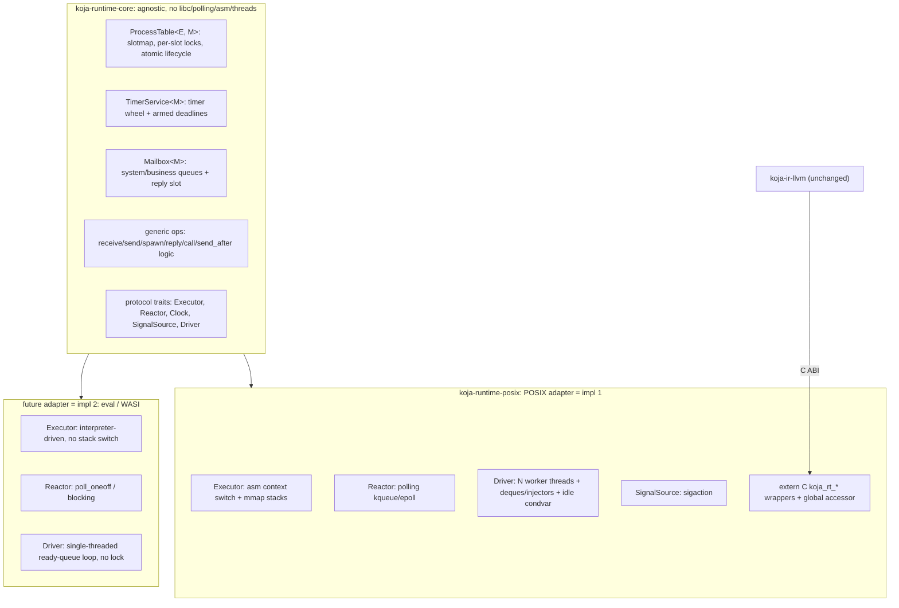

# Scheduler Protocol

The destination design for the Koja runtime as a **formal protocol**
rather than a single hard-coded scheduler. This is the ROADMAP Phase 5
A1 deliverable: define the interface first, make the existing
multi-threaded native scheduler the _first implementation_ of it, and
shape the interface so a **single-threaded cooperative** backend (the
Phase 6 WASM prerequisite, and the path to `koja-ir-eval` process
parity) can be the _second implementation_ without changing the core or
any user code.

This is a destination doc, not a trajectory. Every claim reduces to a
mechanical check, a trait the native runtime already satisfies, or a
behavior pinned by an existing test.

## Scope

This doc covers the **scheduler protocol only**. In scope: the trait
surface, the agnostic-core / platform-adapter seam, the suspension
model, the [internal concurrency model](#internal-concurrency-the-sharded-table),
and the native-side conformance refactor. Out of scope (named in
[Non-goals](#non-goals)): building the cooperative executor for
`koja-ir-eval`, the WASI reactor, monitors / supervision (A0/A2),
preemption, and work-stealing. The protocol must _accommodate_ those;
this effort does not _build_ them.

## Why a protocol

Today the runtime is one concrete scheduler. The _scheduling policy_ is
already platform-agnostic — `ProcessTable`
([`process_table.rs`](../crates/koja-runtime-core/src/process_table.rs)),
`Mailbox` ([`mailbox.rs`](../crates/koja-runtime-core/src/mailbox.rs)), and
the wire envelope ([`wire.rs`](../crates/koja-runtime-core/src/wire.rs))
depend only on `Instant`, raw pointers, and an allocator. But that
policy is reachable only through machinery welded to one platform:

- `SCHED: Mutex<ProcessTable>` + `WORK_AVAILABLE: Condvar` — assumes N
  OS threads contend for the table
  ([`scheduler.rs`](../crates/koja-runtime-posix/src/scheduler.rs)).
- `CURRENT_PID` / `SCHED_SP` / `YIELD_SP` thread-locals — assume one
  process per OS worker.
- `koja_context_switch` (hand-written asm) + `mmap` stacks — assume
  stackful coroutines.
- the `polling`-crate reactor thread
  ([`reactor.rs`](../crates/koja-runtime-posix/src/reactor.rs)) — assumes
  kqueue/epoll.

None of these exist on `wasm32-wasi` (no threads by default, no asm
stack switch, no kqueue). And `koja-ir-eval` can't use any of them
either — it is a synchronous tree-walker, which is why every process
feature there returns `RuntimeError::Unsupported` today. A protocol that
both the native runtime and a single-threaded cooperative backend
satisfy is the one design that unblocks WASM _and_ eval parity at once.

## The seam

Two layers. The **agnostic core** owns scheduling _decisions_; the
**platform adapter** owns _capabilities_ (how a process runs, how I/O
readiness arrives, how time and signals are observed, how the loop is
driven and synchronized).



The seam is the commitment: **scheduling decisions live in core exactly
once; platforms supply capabilities.** A new backend implements the
traits and inherits ready-queue order, mailbox priority, deadline
semantics, kill-tombstone discipline, and counter oracles for free.

## What is agnostic vs platform

The current `Process` struct conflates both layers; splitting it is the
central structural move.

| Concern                                                                       | Layer    | Today                                       | Destination                                         |
| ----------------------------------------------------------------------------- | -------- | ------------------------------------------- | --------------------------------------------------- |
| `state`, `waiting`, `deadline`, `on_cpu`                                      | agnostic | `Process` fields                            | `ProcessControlBlock` in core                       |
| slotmap, generations, transitions, counters, trace                            | agnostic | `ProcessTable`                              | `ProcessTable<X, M>` in core (`X` = `E::Execution`) |
| timers, deadlines, drain grace                                                | agnostic | `TimerService`                              | `TimerService<M>` in core, behind its own lock      |
| ready queue                                                                   | split    | in-core queues + native external-ready seam | driver-owned; wake facts are return values          |
| mailbox routing (system/business/reply, priority, displacement, wait targets) | agnostic | `Mailbox`                                   | `Mailbox<M>` in core (generic over message repr)    |
| `func`, `init_state`, `sp`, `stack`, `tsan_fiber`                             | platform | `Process` fields                            | `E::Execution` owned by the executor                |
| message representation                                                        | platform | byte `Envelope`                             | `M`: native bytes vs coop `Value`                   |
| process activation / suspension                                               | platform | `koja_context_switch`, `process_trampoline` | `Executor` trait                                    |
| fd readiness                                                                  | platform | `reactor.rs` (`polling`)                    | `Reactor` trait                                     |
| run loop + synchronization                                                    | platform | `worker_loop`, `SCHED` Mutex, `Condvar`     | `Driver` trait                                      |
| clock                                                                         | platform | `Instant::now()` inline                     | `Clock` trait                                       |
| OS signals                                                                    | platform | `signals.rs` (`sigaction`)                  | `SignalSource` trait                                |
| allocator                                                                     | shared   | `memory.rs` (libc passthrough)              | stays libc passthrough; see [Allocator](#allocator) |

## Glossary

- **Agnostic core.** `koja-runtime-core`: the `ProcessTable`, `Mailbox`,
  wire/message types, scheduling-policy code, generic runtime
  operations, and the protocol traits. No `libc`, no `polling`, no asm,
  no `std::thread`.
- **Platform adapter.** A crate implementing the protocol traits for one
  target. `koja-runtime-posix` is the first; `koja-runtime-wasi` and a
  cooperative eval adapter come later.
- **`ProcessControlBlock` (PCB).** The agnostic per-process record:
  lifecycle `state`, `waiting` target, optional `deadline`, `on_cpu`
  claim flag. Holds an `E::Execution` for the executor's private
  execution state — a PCB is precisely the structure that owns a
  process's saved execution, so the core stores it without inspecting it.
  (Since the sharding landed this is the table's internal `Slot`: the
  lifecycle word, the mutex-guarded hot state, and the execution cell.)
- **Execution state (`E::Execution`).** Everything an executor needs to
  run and resume one process. Native: entry fn, config payload, saved
  `sp`, stack mapping, TSan fiber. Cooperative: entry reference, config
  value, and resumption state.
- **Continuation (`E::Continuation`).** The small `Copy` resume token the
  driver marshals in and out of the PCB around a `resume` — a projection
  of the execution state (native: the saved `sp`). It crosses the lock
  boundary by value so no `&mut Execution` is held across a switch.
- **Yield.** The act of a running process handing control back to the
  driver at a suspension point (`receive`, `io_block`). The driver reads
  _why_ from the PCB's lifecycle `state`, the authoritative record it
  must consult anyway to handle a concurrent kill or wake.
- **Suspension point.** A site in a process body that may yield:
  `koja_rt_receive[_timeout]`, `koja_rt_call_receive`, and `io_block`.
  The **release-before-suspend invariant** governs all of them.

## Capability traits

Sketches, not frozen signatures — the spike refines them. They show the
shape and the obligations.

### `Executor`

Owns how a process is entered, suspended, and resumed. This is the trait
that abstracts stackful-vs-cooperative.

```rust
pub trait Executor {
    /// Per-process execution state the core stores opaquely in the PCB.
    type Execution;
    /// The Copy resume token the driver marshals in/out of the PCB around
    /// a resume — a projection of Execution (native: the saved `sp`).
    type Continuation: Copy;
    /// Message payload representation carried in this executor's mailbox.
    type Message: Message;

    /// Enter or continue `pid` from `continuation`, run it until it
    /// yields, and return the token to resume it next time. Called by the
    /// Driver with the core lock/borrow *released*.
    fn resume(&self, pid: Pid, continuation: Self::Continuation) -> Self::Continuation;
}
```

`resume` deliberately trades only the `Copy` `Continuation`, not
`&mut Execution`: the native switch releases the core lock across the
context switch, and the running process reads its own execution state
mid-switch (the trampoline re-locks to read entry fn + config), so a
borrow can't span the suspension point. The driver reads the prior token
out of the PCB under the lock, drops the lock, calls `resume`, stores the
returned token back, and reads the PCB's lifecycle `state` to decide what
to do next — there is no separate yield-reason channel, because a
concurrent kill or wake means the PCB is the only trustworthy source.

Construction is **not** a trait method: each backend builds its own
`Execution` from its own spawn entry point (native: `koja_rt_spawn` maps
a stack and copies the config; cooperative: the eval driver's spawn
builtin), so there is no generic caller for a `create`.

Native `resume` does a `koja_context_switch` into the process stack and
returns the saved `sp`. Cooperative `resume` calls the interpreter to run
the process until it reaches a suspension point and returns its
resumption token — no stack switch.

The suspension primitive itself (what `koja_rt_receive` calls to give up
control) is the executor's inverse of `resume`. Native: switch back to
the worker's scheduler stack. Cooperative: return up the interpreter
call stack to the driver. Both obey the same invariant below.

### `Reactor`

Abstracts fd readiness. Unifies the two existing modes — `io_block`
(promote a `WaitingIO` waiter) and `Fd.watch` (deliver an `IOReady`
message) — behind one waker vocabulary, which also resolves
[RUNTIME-GAPS.md](RUNTIME-GAPS.md) gap #2 (the two keyspaces multiplexed
into one integer).

```rust
pub trait Reactor {
    fn register(&self, fd: Fd, interest: Interest, waker: Waker);
    fn deregister(&self, fd: Fd);
    /// Drive one readiness pass; return the wakers whose fds fired.
    fn poll(&self, timeout: Option<Duration>) -> Vec<Waker>;
}

pub enum Waker {
    Resume(Pid),                                  // io_block: WaitingIO -> Runnable
    Deliver { fd: Fd, pid: Pid, readiness: Readiness }, // watch: enqueue an IOReady
}

pub enum Readiness { Error, Readable, Writable } // the fired direction
```

The waker is registered as the _action_ to take; `poll` returns it with
the `Deliver` `readiness` filled in from the event that fired (the
`IOReady` variant a watcher observes). The poller tracks one registration
per fd, so the native reactor stores a single `fd -> Waker` map — the last
`register` wins, matching the poller's own semantics, which is why the two
old keyspaces collapse into one.

Native drives `poll` on a dedicated thread (`polling` crate) and applies
the returned wakers (promote under `SCHED`, then send `IOReady`s after).
A cooperative driver calls `poll` inline when the ready queue empties
(WASI `poll_oneoff`; eval may block the single thread on the syscall and
skip the reactor entirely for the blocking path).

### `Clock`, `SignalSource`

Leaf services.

```rust
pub trait Clock { fn now(&self) -> Instant; }

pub trait SignalSource {
    fn install(&self);
    fn drain(&self) -> Vec<Lifecycle>; // Shutdown / Interrupt / Reload
}
```

`signals.rs` already drains into `Lifecycle` variant indices and is
documented as shared between the LLVM runtime and eval; it becomes the
POSIX `SignalSource`. WASM has no POSIX signals — its `SignalSource` is
a no-op or host-specific.

### `Driver`

Owns the run loop and _all_ synchronization. This is where
multi-threaded and single-threaded diverge most.

```rust
pub trait Driver {
    /// Boot the runtime and run until the entry process dies. Replaces
    /// `koja_rt_main_done`.
    fn run(self, core: Core<Self::Executor>);
}
```

- **Native `Driver`:** spawns `worker_count()` worker threads plus a
  reactor thread, owns the work-stealing deques and injectors, parks
  idle workers on a condvar, sets `SHUTDOWN` when PID 1 dies, joins.
- **Cooperative `Driver`:** single thread, single loop. Drain due
  timers/deadlines and signals; claim; `resume`; `after_switch`; when
  the ready queue empties, `reactor.poll` (or block) for the nearest
  wakeup; exit when the entry dies.

The agnostic core exposes `try_claim`, `after_switch`, `deliver`,
`try_park`, and the `TimerService` operations. **The core contains no
driver-wide lock and never blocks.** Its internal synchronization is
the fine-grained sharding described in
[Internal concurrency](#internal-concurrency-the-sharded-table): per-slot
mutexes and lifecycle atomics that a multi-threaded driver contends on
and a single-threaded driver pays nearly nothing for.

## Generic runtime operations

The `koja_rt_*` _logic_ (peek mailbox, park if empty, yield, re-peek;
token correlation for `call`; envelope routing for `send`) is
platform-agnostic and lives in core **once**, generic over the traits:

```rust
pub fn receive<E: Executor>(rt: &Runtime<E>, out: *mut u8, cap: i64) -> i64;
pub fn send<E: Executor>(rt: &Runtime<E>, pid: Pid, msg: E::Message);
pub fn spawn<E: Executor>(rt: &Runtime<E>, entry: EntryPoint, config: Config<E>) -> Pid;
// ... reply, call_receive, send_after, kill, is_alive, self_pid
```

Each adapter provides only the thin `#[no_mangle] extern "C"` wrappers
and a global accessor:

```rust
#[unsafe(no_mangle)]
pub extern "C" fn koja_rt_receive(out: *mut u8, cap: i64) -> i64 {
    koja_runtime_core::receive(global_runtime(), out, cap)
}
```

Per-adapter wrappers (≈25 one-liners) rather than `dyn`-dispatched
symbols in core: they stay zero-cost, and Phase 6's "FFI resolves to
WASM imports rather than linker symbols" means the wrapper layer is
exactly where target divergence belongs.

## The suspension model (the crux)

The one decision the spike must nail. A suspension point must give up
control _without_ assuming OS threads or asm stack switching.

Options considered:

1. **OS thread per process** (the archived
   [20260612-EVAL-PROCESS.md](archive/20260612-EVAL-PROCESS.md) plan):
   `receive` blocks a channel. Rejected by the A1 WASM constraint — WASM
   has no threads, and this caps at hundreds of processes.
2. **Stackful coroutines everywhere** (asm context switch): native
   already does this; WASM can't (no portable stack switch without
   Asyncify, which is a toolchain feature, not a runtime one).
3. **Executor-owned suspension** (chosen): the _core_ defines suspension
   abstractly as "executor yields control back to the driver, leaving the
   reason in the PCB"; each executor implements it in its native idiom.

**Decision: option 3.** The `Executor` owns activation and suspension;
the core never names a stack or a thread. Native implements suspension
as a context switch; a cooperative interpreter implements it as
returning up its own Rust call stack to the driver loop. WASM later
implements it via whatever the chosen flavor supports (Asyncify or an
explicit interpreter state machine). The core is identical across all
three.

### The release-before-suspend invariant

The load-bearing rule that makes one set of scheduling code correct on
both a `Mutex`-guarded native core and a single-borrow cooperative core:

> A suspension point must **release its access to the core** (drop the
> `Mutex` guard / end the `&mut` borrow) _before_ yielding, and
> re-acquire it _after_ resuming.

Native already obeys this — `koja_rt_receive` drops the `SCHED` guard
before `yield_to_scheduler`, and `io_block` drops it before
`koja_context_switch`. Stated as a protocol invariant, the same code is
correct cooperatively: the single-threaded driver can reuse the core
the moment the suspending process returns to it, with no aliasing.

## Internal concurrency: the sharded table

The seam above fixes _where_ scheduling decisions live. This section
fixes how the core is synchronized _internally_, so a multi-threaded
driver scales past a single global lock. The destination: no
table-wide mutex. `ProcessTable`'s hot-path methods take `&self`, hot
per-process state sits behind a per-slot mutex or lifecycle atomics,
and the only remaining global locks guard cold state.

Two steps have already landed on the way here:

1. **Lock-free yield fast path.** A voluntary yield (`koja_rt_yield_check`)
   sets a worker-thread-local flag instead of taking the table lock;
   the worker replays the `Running -> Runnable` edge under the lock
   hold it already needs for `after_switch`.
2. **`TimerService` split.** Timers, deadlines, and the drain grace
   live behind their own lock (native: a `Mutex` gated by an atomic
   next-fire instant; cooperative: a plain owned value). The table
   only records the armed deadline instant, and
   `ProcessTable::promote_expired` re-validates every fired entry, so
   the timer lock and the table lock are never held together.

The remainder — the actual sharding — is the structural change
specified here, and has since **landed**: the table's hot paths take
`&self`, the `SCHED` static is gone, and both drivers own their ready
queues, fed by returned wake facts. It did not touch the suspension
model: the
[release-before-suspend invariant](#the-release-before-suspend-invariant)
holds unchanged, with "access to the core" now meaning whichever slot
lock the suspension point holds. A suspension point still releases
everything before yielding, so a single-threaded cooperative driver
remains a valid consumer of the identical core.

### State inventory

Every field of today's `ProcessTable` and PCB, assigned to a shard by
access pattern:

| State                                                                               | Shard      | Synchronization                                 |
| ----------------------------------------------------------------------------------- | ---------- | ----------------------------------------------- |
| `state` + `on_cpu`                                                                  | per slot   | one packed lifecycle atomic, CAS edges          |
| `priority`, `reductions_left`                                                       | per slot   | relaxed atomics                                 |
| `mailbox`, `waiting`, `awaiting_reply`, `deadline`                                  | per slot   | the slot mutex                                  |
| `execution`, `parent`, `exit_reason`, `crash_info`                                  | per slot   | claim-holder / death-path owned (see below)     |
| slot `generation`                                                                   | per slot   | packed into the lifecycle word (see below)      |
| freelist + slot growth, `monitors`, exit notices, pending kills, `mode`, `main_pid` | global     | the registry mutex                              |
| timer wheel, armed deadlines, drain grace                                           | global     | the timer lock (landed)                         |
| `alive` / `active`, `ScheduleCounters`                                              | global     | relaxed atomics (or per-worker, folded on read) |
| trace                                                                               | per worker | thread-local rings + one atomic sequence        |

The trace cannot sit behind any global lock: `transition` records an
event on every edge unconditionally (`KOJA_SCHED_TRACE` gates only the
dump), so a locked trace would put a global acquisition back on every
hot operation. Each worker records into its own ring, entries are
stamped from a shared atomic sequence counter, and the dump merges the
rings in sequence order.

The cold row's ownership rule: `execution` is written only by the
worker holding the `on_cpu` claim (the publish-before-save handoff
below makes that safe); `parent` is immutable after spawn; `exit_reason`
and `crash_info` are written under the slot mutex on the death path and
read after the `Dead` edge is published.

Slot storage itself must not move under concurrent readers, so the
slots live in append-only segments (a chunked arena) rather than a
reallocating `Vec`. The registry mutex guards growth and the freelist;
readers index lock-free and validate a PID's generation against the
slot's lifecycle word (where it lives, see below). `free` bumps it
under the slot mutex, so a holder of that mutex who has validated the
generation cannot have the slot recycled out from under it.

### Lock hierarchy

Three lock kinds exist in the core: the per-slot mutexes, the registry
mutex, and the timer lock. The hierarchy is flat:

> **At most one core lock is held at any time.** Never two slot locks,
> and never a slot lock with the registry or timer lock.

Cross-shard effects use the staged-drain pattern Stage 2 established
for timers: record the effect under one lock, release, apply under the
next, and **re-validate at the apply site** because the world may have
moved between the two holds. `promote_expired` is the template; exit
notices, kill cascades, and freed-deadline cancellation follow it. The
flat hierarchy makes deadlock impossible by construction, and every
lost race lands in a named counter (`stale_claims_skipped`,
`stale_deadlines_skipped`, `parks_refused`, ...), so coverage is
observable, not assumed.

### The lifecycle word and its CAS edges

`state`, `on_cpu`, and the slot's **generation** pack into one atomic
`u64` (32 bits generation, a few bits state, one bit `on_cpu`).
Claiming is a single decision across all three: "the process I mean
(this generation), runnable, and not still being saved". The
generation must live in the word because a CAS on state alone is
ABA-unsafe: between a claimer's generation check and its CAS, the slot
can be freed and respawned, and the CAS would then claim the _new_
occupant while the claimer proceeds with the old PID, leaving the new
process marked `Running` with no worker resuming it. With the
generation in the word, a stale claim fails the CAS itself. `free`
bumps the generation in the word, which atomically invalidates every
stale edge aimed at the old occupant.

The legal-edge table (`is_legal_transition`) is preserved exactly; each
edge becomes a CAS, and an illegal observed edge still counts a
violation (the oracle stays).

Edges split into two disciplines. **Coupled edges** — those whose
decision reads or writes the slot's messaging state (`waiting`,
mailbox contents, `deadline`, `awaiting_reply`) — CAS the word _while
holding the slot mutex_, which is what makes deliver-vs-park
linearizable. **Claim-family edges** touch only the word itself and
CAS lock-free.

| Edge                                                                | Performer                          | Slot mutex | On lost CAS                                                     |
| ------------------------------------------------------------------- | ---------------------------------- | ---------- | --------------------------------------------------------------- |
| gen match + `Created`/`Runnable` + `!on_cpu` -> `Running`, `on_cpu` | claiming worker                    | no         | stale claim: count it, pop the next candidate                   |
| `Running` -> `Runnable` (yield, keeps `on_cpu`)                     | owning worker at switch-out        | no         | a kill won (`Dead`): fall through, reclaim at switch-out        |
| `Running` -> `Blocked` / `WaitingIO` (park)                         | the process, at a suspension point | yes        | a kill won: park refused, process yields anyway, owner reclaims |
| `Blocked` -> `Runnable` (message wake)                              | any sender                         | yes        | already woken or resumed: skip, the envelope stays queued       |
| `Blocked` -> `Runnable` (deadline fire)                             | timer apply                        | yes        | `deadline != fire_at` or not `Blocked`: stale skip, counted     |
| `WaitingIO` -> `Runnable`                                           | reactor, or a lifecycle sender     | yes        | already woken: skip                                             |
| live -> `Dead` (kill)                                               | any worker                         | yes        | already `Dead`: no-op. `on_cpu` set: mark only, owner reclaims  |
| `on_cpu` clear (after_switch)                                       | owning worker                      | no         | single owner, cannot lose                                       |

The publish-before-save window closes on this word's ordering: the
owning worker stores the saved `sp` into `execution`, then
release-CASes the `on_cpu` clear; a claimer's acquire-CAS setting
`on_cpu` is what licenses its subsequent `sp` read. One word, one
happens-before edge, no fence bookkeeping elsewhere.

### Ready queue: direct enqueue

With per-slot operations, `transition` can no longer push into a
table-owned ready queue (that queue would just become the next global
lock). Wake edges instead _return the wake fact_ to their caller, and
the wake site routes the PID itself: the native adapter pushes to the
running worker's deque (co-location) or a global injector — both
lock-free — and the cooperative driver pushes to its own plain queue.

This retires the `external_ready` / `pending_ready` staging and the
`publish_ready` round-trip entirely: wakes no longer detour through
table-internal staging that the adapter must remember to drain. Claim
validation stays in core (`try_claim` CAS), so a stale queue entry is
still skipped centrally no matter which queue it came from. The ready
queue thereby becomes a `Driver` capability on every platform, and the
in-core `ready` queues are deleted rather than kept as a second path.

Retiring the table mutex also orphans the idle-park condvar, which
today pairs with it. The native driver gives `WORK_AVAILABLE` its own
small mutex guarding a sleeper count. A parker increments the count
under that mutex, re-checks the queues, and waits; a wake site pushes
its PID first, then, only when the sleeper count is nonzero, takes the
mutex to notify. Because pushes are lock-free, the re-check alone
cannot close the lost-wakeup window (today's code has the same window);
the sleeper-count handshake closes it, and the existing bounded timed
parks stay as the backstop.

### Invariants re-argued

The windows the global mutex used to close for free, and what closes
them now. Each gets a targeted stress case in the `scheduler_stress`
harness.

1. **Deliver vs park.** Both take the slot mutex, and the park's
   mailbox re-peek plus its `Running -> Blocked` CAS happen inside one
   hold. A delivery is therefore either fully before (the re-peek sees
   the message, no park) or fully after (the deliverer sees `Blocked`
   with a matching `waiting` and wakes). No lost wakeup; the
   linearization point is the slot mutex.
2. **Kill landing mid-run.** `* -> Dead` CASes under the slot mutex and
   may hit a process whose `on_cpu` bit is set. The packed word means
   the killer sees that atomically: it marks `Dead` but defers reclaim,
   and the owning worker's switch-out observes `Dead` and frees the
   slot. The park-over-tombstone refusal is the same CAS losing to
   `Dead`, exactly today's semantics.
3. **Publish before save.** Claiming a process whose previous worker
   has not yet persisted its `sp` would resume a stale frame. Closed by
   the release/acquire pair on the lifecycle word described above.
4. **Reply check-and-slot.** `ReplyTo.send` must decide
   `Delivered`-vs-`Expired` atomically against the caller's timeout.
   Both sides serialize on the _caller's_ slot mutex: the replier
   checks `awaiting_reply == token` and slots the reply under one hold;
   the timeout path clears `awaiting_reply` under the same mutex. Same
   linearizability as today's global hold, one-slot scope.
5. **Monitor vs kill.** Exit notices linearize on the registry mutex.
   `monitor` decides aliveness _and_ inserts its entry under one
   registry hold; a kill CASes `Dead` first, then runs its
   evict-and-stage pass under the registry. The two holds order each
   other: an entry inserted before the kill's pass is found and staged,
   and a `monitor` running after the CAS observes `Dead` and stages the
   immediate notice instead. Deciding aliveness outside the registry
   hold would lose the signal (insert lands after the killer's scan),
   so that ordering is normative, not advisory.
6. **Spawn vs kill vs teardown.** A deferred kill marks an `on_cpu`
   spawner `Dead` while it is still executing, and the kill cascade has
   already staged its children (from the registry's parent-to-children
   index, maintained at spawn and death), so an uncoordinated spawn afterwards
   creates an orphan the cascade never sees and can transiently drop
   the `alive` count to zero, tearing the runtime down under a live
   child. (The orphan half of this window exists under today's global
   mutex too: `koja_rt_spawn` checks draining but not the spawner's own
   tombstone.) The rule: spawn, the kill cascade's stage-and-drain, and
   the teardown decision all linearize on the registry mutex, and spawn
   re-checks the spawner's lifecycle word under that hold, refusing
   (PID 0, same as the draining refusal) when the spawner is `Dead`.

### Mechanical checks (sharded table)

- No global table lock: `rg "Mutex<NativeTable>|Mutex<ProcessTable"
koja/crates/` returns nothing, and the `SCHED` static is gone.
- The hot-path table methods (`deliver`, `try_park`, `try_claim`,
  `after_switch`, `kill`, `promote_expired`) take `&self`.
- The staging seam is gone: `rg "pending_ready|external_ready|publish_ready"
koja/crates/` returns nothing.
- The flat hierarchy is enforced, not aspirational: in debug builds the
  core's lock wrappers keep a thread-local held-lock count and assert
  it never exceeds one.
- The oracles are unchanged: `koja_rt_sched_violations` stays zero,
  `tests/lang/memory/` leak deltas stay zero, extended `just tsan`
  soaks are clean, and `KOJA_SCHED_TRACE` still yields a coherent
  per-process lifecycle trace.

## Message representation

`Mailbox<M>` and the routing logic (system drained before business,
reply slot one-shot with displacement, `WaitTarget` partitioning) are
generic over the message type `M: Message`, where:

```rust
pub trait Message {
    fn tag(&self) -> Tag;            // Business / Lifecycle / IOReady / Reply
    fn reply_token(&self) -> i64;
}
```

- **Native `M = Envelope`:** byte transport buffer, exactly as today,
  preserving the `wire.rs` ABI that `koja-ir-llvm` emits against.
- **Cooperative `M = Value`** (future): a typed interpreter value with
  the same tag bits, skipping byte (de)serialization — the on-the-wire
  format is observable to nobody but the runtime.

The _priority and lifecycle semantics_ — the part that must stay
identical for observable parity — live in core and are shared.

## Allocator

Allocation is **not a scheduler-protocol concern.** It is a distinct,
orthogonal seam, and it is called out here only to fix that boundary
explicitly — no allocator trait joins the five capability traits above.

The distinction is categorical. The scheduler protocol is a _policy_
interface with genuinely different implementations (multi-threaded,
cooperative, WASI). Allocation is a _provider_ interface — one correct
behavior (`alloc` / `realloc` / `free`), swapped only to change the
backing allocator. Its eventual formalization is therefore most likely
"conform to Rust's `GlobalAlloc` on the Rust side, plus the existing
`koja_alloc` / `koja_realloc` / `koja_free` C-ABI symbol contract on the
codegen side" — not a bespoke Koja trait.

That seam already half-exists.
[`memory.rs`](../crates/koja-runtime-core/src/memory.rs) is not "the
allocator" — it is the _single current implementation_ of an
already-stable contract: codegen emits calls to `koja_alloc` /
`koja_free`, and `memory.rs` is the libc-backed conformer behind those
symbols (with a load-bearing C-interop passthrough equivalence — see its
module doc). The C-ABI symbols are the protocol; the module is an impl.

For this spike and all of Phase 6's primary path, the libc passthrough
stays a **shared module in core**, behind its existing C-ABI contract.
Every planned tier-1 target has a working `malloc`: POSIX (system libc)
and `wasm32-wasip1` (`wasi-libc`); the `libc` crate links on both. The
only genuinely libc-less target is bare-browser `wasm32-unknown-unknown`
— post-1.0 per [ROADMAP.md](ROADMAP.md), and even then resolvable by
_providing_ `malloc` / `free` at link time (link `wasi-libc`, or export
a `dlmalloc` shim) rather than threading an allocator through every core
type. The real forcing function for a second implementation is an arena
/ GC allocator, which `memory.rs`'s own module doc already anticipates —
not browser WASM. Until such an implementation exists, formalizing the
seam buys nothing.

## Worked example: single-threaded cooperative conformance

How a future eval/WASI adapter satisfies the protocol — the proof the
seam is real. (Not built in this spike; included so the trait surface is
validated against its hardest consumer.)

- **`Executor::Execution`** = `{ entry: FnRef, config: Value, resume:
ResumeState }`, with `Continuation` = the resume token (an interpreter
  state handle; possibly `()` if the state lives in `Execution`).
  `resume(pid, continuation)` re-enters the interpreter at the saved
  point, runs until the body hits `receive`/`io_block`, parks via the
  core (recording the reason in the PCB), and returns the next token. No
  stack, no asm.
- **`Driver::run`** = single loop, no threads: `timers.advance` (apply
  `Due` entries via `deliver` / `promote_expired`), `signals.drain`,
  claim, `resume`, `after_switch`; when the driver's ready queue is
  empty, `reactor.poll(timers.next_fire())` or block; exit on entry
  death. Identical control flow to `worker_loop`, minus the workers.
- **`receive`** runs the _core_ `receive` op: peek the mailbox (core),
  park via `try_park` (core), end the borrow, return to the driver
  (executor suspension), and on resume re-peek (core). The borrow
  discipline is the same statements native runs under the lock.
- **`Reactor`** = either WASI `poll_oneoff` driving `Waker::Resume`, or
  (eval expedient) block the single thread on the syscall and never park
  — both legal under the trait.
- **`SignalSource`** = POSIX `sigaction` (eval) or no-op (WASM).

If this adapter compiles against the core with no changes to the core,
the protocol is correct.

## Native conformance (impl #1)

The proof the protocol describes a _real_ scheduler, not an aspiration:
refactor `koja-runtime` to implement the traits with zero behavior
change.

| Trait          | Native implementation                                                                                       | Source today                                    |
| -------------- | ----------------------------------------------------------------------------------------------------------- | ----------------------------------------------- |
| `Executor`     | asm `koja_context_switch`, `mmap` stacks, `process_trampoline`, TSan fibers                                 | `scheduler.rs`, `ffi.rs`, `arch/*.s`, `tsan.rs` |
| `Reactor`      | `polling` kqueue/epoll on a dedicated thread                                                                | `reactor.rs`                                    |
| `Driver`       | N worker threads, work-stealing deques + injectors, idle `Condvar`, `SHUTDOWN`, cgroup-aware `worker_count` | `scheduler.rs`                                  |
| `Clock`        | `Instant::now()`                                                                                            | inline                                          |
| `SignalSource` | `sigaction` latch + drain                                                                                   | `signals.rs`                                    |
| message `M`    | `Envelope` (byte wire)                                                                                      | `wire.rs`                                       |

The race/leak oracles (`koja_rt_sched_violations`, `koja_rt_live_blocks`,
`tests/lang/memory/`) and `just tsan` are the guardrails: behavior must
not move.

## Crate structure and the unchanged C ABI

- **New `koja-runtime-core`** (`rlib`): agnostic core + trait defs. No
  `polling`, no asm, no `std::thread`; `libc` only for the allocator.
- **`koja-runtime-posix` (the POSIX adapter, `staticlib`).** Renamed
  from `koja-runtime`; depends on `koja-runtime-core`, implements the
  traits, and hosts the `extern "C" koja_rt_*` wrappers. Its `[lib]
name` is pinned to `koja_runtime`, so `libkoja_runtime.a`, the
  `-lkoja_runtime` link flag, and the embedded-archive bytes in
  [`koja-driver/src/link.rs`](../crates/koja-driver/src/link.rs) are
  **untouched**, and `koja-ir-llvm` needs **zero** code changes.

That `koja-ir-llvm` compiles and passes against an unchanged C ABI is
the integration proof that the shim is a clean seam.

## What moves where

| File                                                                                                               | Destination                                                    |
| ------------------------------------------------------------------------------------------------------------------ | -------------------------------------------------------------- |
| `process_table.rs`, `mailbox.rs`, `wire.rs`, `scheduler_trace.rs`                                                  | core (generic over `E`, `M`)                                   |
| scheduling-policy + generic `koja_rt_*` logic (extracted from `scheduler.rs`)                                      | core                                                           |
| trait defs (`Executor`, `Reactor`, `Clock`, `SignalSource`, `Driver`, `Message`)                                   | core (new)                                                     |
| `memory.rs`                                                                                                        | core (shared libc passthrough)                                 |
| asm stacks, `process_trampoline`, `worker_loop`, `koja_rt_main_done`, Mutex/Condvar, thread-locals, `worker_count` | `koja-runtime-posix` (native `Executor` + `Driver`)            |
| `reactor.rs`                                                                                                       | `koja-runtime-posix` (native `Reactor`)                        |
| `signals.rs`                                                                                                       | `koja-runtime-posix` (native `SignalSource`)                   |
| `tsan.rs`, `ffi.rs`, `arch/*.s`                                                                                    | `koja-runtime-posix` (native executor detail)                  |
| `extern "C" koja_rt_*` wrappers + global accessor                                                                  | `koja-runtime-posix`                                           |
| `fs.rs`, `socket.rs`, `system.rs`, `intrinsics/`, `string`, `format`, `util`, `parse_text`                         | `koja-runtime-posix` (POSIX externs; not scheduler, untouched) |

## Mechanical checks

- `koja-runtime-core` imports neither `polling` nor any asm. Grep:
  `rg "use polling" koja/crates/koja-runtime-core/` returns nothing;
  `koja-runtime-core/Cargo.toml` has no `polling` dependency.
- `koja-runtime-core` does not spawn OS threads. Grep:
  `rg "std::thread|thread::spawn" koja/crates/koja-runtime-core/`
  returns nothing.
- The scheduling policy is not duplicated: `try_claim`,
  `promote_expired`, mailbox priority, and the legal-transition
  table exist only in `koja-runtime-core`.
- `koja-ir-llvm` is unchanged: no diff under `koja/crates/koja-ir-llvm/`,
  and `koja-driver/src/link.rs` still links `-lkoja_runtime`.
- The `koja_rt_*` C ABI symbol set is unchanged (same names, same
  signatures). Diff the `#[no_mangle]` symbol list before/after.
- Native behavior unchanged: `koja_rt_sched_violations` stays zero,
  `tests/lang/memory/` leak deltas stay zero, `just tsan` reports no
  races, `tests/lang/process_*` pass.

## Non-goals

- **The cooperative executor / eval process parity.** This spike defines
  the protocol and proves it with the native impl; building the eval
  `Executor`/`Driver` (spawn, mailboxes, `Ref`/`ReplyTo`, business
  `receive`) is the follow-on.
- **The WASI adapter** (`poll_oneoff` reactor, WASM FFI). Phase 6.
- **Monitors / supervision** (A0/A2). The protocol must not preclude them;
  it does not add them here. (**Preemption + priority**, **native
  work-stealing run queues**, and the
  [sharded table](#internal-concurrency-the-sharded-table) have since
  landed — see ROADMAP A1. The native adapter owns per-worker,
  per-priority deques plus global injectors, the cooperative driver owns
  a `ReadyQueue`, and both are fed by the wake facts the table returns.)
- **An allocation protocol.** Allocation is a separate, already-latent
  seam (the `koja_alloc` / `koja_free` C-ABI contract), not a sixth
  scheduler trait. See [Allocator](#allocator). It stays a shared core
  module until a second implementation (arena / GC, or a libc-less
  target) actually forces the issue.
- **Behavior changes.** Native observable semantics are frozen by the
  oracles above; this is a refactor, not a redesign.

## References

- [ROADMAP.md](ROADMAP.md) — Phase 5 A1 (scheduler protocol) and Phase 6
  (WASM runtime split into `koja-runtime-core` + per-target adapters).
- [COMPILER-NORTHSTAR.md](COMPILER-NORTHSTAR.md) — backends as siblings
  over a sealed `IRProgram`; this protocol is the runtime analogue.
- [RUNTIME-GAPS.md](RUNTIME-GAPS.md) — gap #2 (typed `EventKey`) folds
  into the `Reactor`/`Waker` vocabulary; gap #3 (wake `WaitingIO` on
  message) is a `Reactor`/core policy question surfaced by the seam.
- [ABI.md](ABI.md) — the `koja_rt_*` and `wire.rs` contract this spike
  preserves verbatim.
- [archive/20260612-EVAL-PROCESS.md](archive/20260612-EVAL-PROCESS.md) —
  the superseded thread-per-process eval plan; its observable-parity
  test strategy and typed-`Value`-mailbox rationale are inherited here.
- [crates/koja-runtime-posix/src/scheduler.rs](../crates/koja-runtime-posix/src/scheduler.rs)
  — the native reference implementation; when observable semantics are
  in doubt, the native runtime is the spec.
