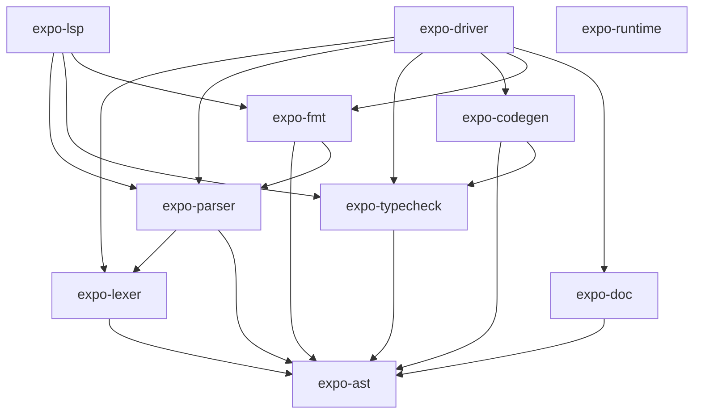

# Expo Codebase Quality Report

## Project at a glance

A solo-developer language compiler: lexer, parser, type checker, LLVM codegen, formatter, doc generator, LSP, and runtime — all in ~56k lines of Rust across 10 workspace crates. The project ships 7 CLI commands, editor extensions for VS Code and Vim, and a cooperative process runtime with platform-specific assembly. At v0.7.0, the language already compiles generics, processes, unions, closures, and binary/bitstring literals to native code. That is a substantial amount of working functionality.

| Crate          | Lines  | Role                                |
| -------------- | ------ | ----------------------------------- |
| expo-codegen   | 23,271 | LLVM IR generation (inkwell)        |
| expo-typecheck | 12,488 | Type inference, semantic analysis   |
| expo-parser    | 6,856  | Recursive-descent, Pratt precedence |
| expo-lsp       | 3,462  | Language server                     |
| expo-fmt       | 2,588  | Opinionated formatter               |
| expo-ast       | 1,886  | Tokens, spans, AST nodes            |
| expo-lexer     | 1,852  | Tokenizer                           |
| expo-driver    | 1,700  | CLI binary                          |
| expo-runtime   | 960    | Cooperative process scheduler       |
| expo-doc       | 766    | HTML doc generator                  |

---

## What the codebase does well

### 1. Architecture and crate decomposition

The 10-crate workspace is cleanly layered. `expo-ast` is a pure data crate with no compiler logic. The lexer depends only on the AST. The parser depends on the lexer and AST. The type checker depends only on the AST. Codegen depends on the AST and type checker. The driver and LSP wire everything together. This means each phase can be understood, built, and (in principle) tested independently.

The dependency graph is acyclic and narrow:

### 2. Error recovery and diagnostics

The compiler consistently uses a **diagnostic accumulation** model rather than fail-fast `Result` propagation. The parser synthesizes placeholder nodes on errors and continues, the type checker pushes diagnostics into `TypeContext` and uses `Type::Unknown` / `Type::Error` for poisoned expressions, and codegen returns `Result<(), Vec<Diagnostic>>`. This is the right design for a language toolchain — it means the LSP and `expo check` can report multiple errors per file.

### 3. Documentation quality (in specific crates)

- [expo-ast/src/ast.rs](expo/crates/expo-ast/src/ast.rs) has excellent doc comments on nearly every AST node, enum variant, and field. This is the gold standard in the repo.
- [expo-typecheck/src/cycle.rs](expo/crates/expo-typecheck/src/cycle.rs) has a clear module-level doc and well-documented functions — a model for the rest of the crate.
- [expo-typecheck/src/env.rs](expo/crates/expo-typecheck/src/env.rs) and [expo-typecheck/src/check.rs](expo/crates/expo-typecheck/src/check.rs) have `//!` module docs explaining their role in the pipeline.
- The design folder ([design/](expo/design/)) is thorough: ROADMAP, COMPILER, TYPES, MEMORY, CONCURRENCY, and BITSTRINGS docs explain design rationale, not just what exists.

### 4. Parser design

The parser uses a clean Pratt precedence scheme with binding powers declared as a table at the top of [expo-parser/src/expr.rs](expo/crates/expo-parser/src/expr.rs). The split into `expr.rs`, `stmt.rs`, `decl.rs`, `control.rs`, `pattern.rs`, `construct.rs`, and `types.rs` as extension `impl Parser` blocks keeps one struct while avoiding a single 7,000-line file. The `expect_gt` hack for `>>` vs nested generics is a nice, explicit solution.

### 5. The lexer is well-tested

[expo-lexer/src/lexer.rs](expo/crates/expo-lexer/src/lexer.rs) has 17 focused unit tests covering empty input, strings, escapes, interpolation, multiline strings, and edge cases. This is the best-tested crate in the project.

### 6. Integration test suite

The driver has a golden-output test suite: 61 `.expo` + `.expected` pairs in `tests/lang/` and 8 compile-fail tests in `tests/lang/compile_fail/`. This provides real end-to-end coverage of the build pipeline from source to executed output.

### 7. Stdlib embedding

The type checker embeds stdlib `.expo` source files ([expo-typecheck/std/](expo/crates/expo-typecheck/std/)) and merges them into the type context at startup. This is a practical, zero-dependency approach for bootstrapping a stdlib — the stdlib is written in expo itself and type-checked by the same checker.

### 8. Modern Rust

The codebase uses edition 2024 features comfortably: `let`-chains, `if let ... &&`, `matches!`, modern closure syntax. The code reads as natural, idiomatic Rust throughout.

---

## What could be improved

### 1. Unit test coverage is thin (the biggest gap)

Only **3 out of 10 crates** contain any `#[test]` functions:

| Crate                           | Unit tests |
| ------------------------------- | ---------- |
| expo-lexer                      | 17         |
| expo-parser (construct.rs only) | 14         |
| expo-typecheck (lib.rs only)    | 8          |
| All other crates                | 0          |

That means **expo-codegen (23k lines), expo-fmt, expo-doc, expo-lsp, expo-runtime, and expo-ast have zero unit tests**. The parser only tests string/binary construction — Pratt expression parsing, statement parsing, declaration parsing, control flow, and pattern parsing are untested at the crate level.

The integration suite (`tests/lang/`) provides end-to-end coverage, but it cannot isolate regressions to a specific phase. A type checker bug and a codegen bug produce the same symptom (wrong output or crash), making debugging slower.

**Recommendation:** Prioritize unit tests for `types.rs` (unify/substitute), `collect.rs` (import resolution), and `pattern.rs` (exhaustiveness) in the type checker. These are the highest-complexity, most-likely-to-regress areas. In the parser, test expression precedence and error recovery.

### 2. Large files accumulating multiple responsibilities

Several files have grown past the point where they are easy to navigate:

| File                                                                       | Lines   | Concern                                                                                          |
| -------------------------------------------------------------------------- | ------- | ------------------------------------------------------------------------------------------------ |
| [expo-typecheck/src/collect.rs](expo/crates/expo-typecheck/src/collect.rs) | 1,616   | AST collection, import resolution, protocol synthesis, **two** parallel AST substitution walkers |
| [expo-typecheck/src/expr.rs](expo/crates/expo-typecheck/src/expr.rs)       | 1,584   | All expression type inference                                                                    |
| [expo-codegen/src/expr.rs](expo/crates/expo-codegen/src/expr.rs)           | ~2,000+ | All expression codegen                                                                           |

`collect.rs` is the most concerning because it mixes distinct responsibilities. The two near-duplicate walkers — `substitute_self_in_expr` (lines 1357-1523) and `substitute_named_in_expr` (lines 1135-1286) — are a maintenance hazard. They are ~300-line `match` blocks that must be updated in lockstep when the AST changes.

**Recommendation:** Extract a generic AST visitor/folder that both substitution passes can share. Consider splitting `collect.rs` into `collect.rs` (type collection), `imports.rs` (resolution), and `substitute.rs` (AST rewriting).

### 3. Code duplication across crate boundaries

Several patterns are repeated in 3-4 places:

- **Struct/enum name slices** for `resolve_type_expr` are built identically in `check.rs` (lines 22-35), `pattern.rs` (lines 94-107, 397-410, 475-487), and `lib.rs` (lines 154-167). A `TypeContext::struct_names()` / `enum_names()` helper would DRY this up.
- **Literal overflow checking**: `check_literal_overflow` in `expr.rs` (lines 817-861) vs `check_pattern_literal_overflow` in `pattern.rs` (lines 657-715) — same math, two locations.
- **Stdlib parsing**: `Backend::new` in the LSP and `parse_stdlib()` in the driver both parse and merge stdlib sources independently — drift risk.
- **Merge logic**: `merge_stdlib` in `lib.rs` and `TypeContext::merge` in `context.rs` repeat the same map-merging pattern with minor differences.

### 4. Silent fallback patterns

A few `catch-all` arms silently accept unknown AST variants instead of failing visibly:

- `infer_expr` in [expo-typecheck/src/expr.rs](expo/crates/expo-typecheck/src/expr.rs) (line 575): `_ => Type::Unknown` — if a new `Expr` variant is added, it will silently type-check as unknown rather than producing a compiler error or diagnostic.
- `find_in_expr` in [expo-lsp/src/lookup/traverse.rs](expo/crates/expo-lsp/src/lookup/traverse.rs) (line 489): `_ => {}` — new AST nodes will be invisible to go-to-definition and hover.
- Union exhaustiveness in [expo-typecheck/src/pattern.rs](expo/crates/expo-typecheck/src/pattern.rs) compares types by `display()` string equality (lines 109-128), which is fragile if `Display` formatting ever changes.

**Recommendation:** Use `#[non_exhaustive]` or explicit exhaustive matches in debug builds so new variants surface as compiler warnings during development.

### 5. Heavy `unwrap`/`expect` usage in codegen

Across the codebase there are roughly **1,100+** `unwrap()` / `expect()` calls. The codegen crate alone accounts for the majority — ~700+ calls on LLVM builder operations. While this is common in inkwell-based code (LLVM operations are infallible when invariants hold), any internal bug results in a panic with a generic message rather than a diagnostic pointing at the source location.

The runtime crate also uses panics/aborts for out-of-bounds string access and UTF-8 violations at the C ABI boundary.

### 6. LSP is feature-incomplete and untested

- **Completion** returns all keywords and all symbols globally — it does not filter by cursor position or prefix ([expo-lsp/src/completion.rs](expo/crates/expo-lsp/src/completion.rs) lines 24-46). Duplicate entries can appear when stdlib and user symbols overlap.
- **Formatting** re-reads the file from disk instead of using the editor's open buffer, so unsaved changes are ignored.
- **No tests at all** — no unit tests, no integration tests. Regressions are only caught by manual editor use.
- Silent `Ok(None)` on I/O failures in go-to-definition hides real problems.

### 7. Platform coupling in tests

The integration test harness in [expo-driver/tests/lang_suite.rs](expo/crates/expo-driver/tests/lang_suite.rs) hard-codes `LIBRARY_PATH` to `/opt/homebrew/lib` — this is macOS/Homebrew-specific and will fail or behave incorrectly on Linux CI without manual override.

### 8. Minor issues

- A prebuilt binary (`recursive_type`) is checked into the repo root — should be gitignored or built by CI.
- `#[allow(dead_code)]` in a few places may be stale (e.g., `DocumentState::source` in the LSP is actually used).
- The parser's stuck-token loops (`if self.pos == before { self.advance(); }`) silently skip tokens without emitting a diagnostic in several places.
- Manual argv parsing in the driver works but won't scale well if more flags/subcommands are added.

---

## Overall assessment

This is a **well-architected, competently written** compiler for a solo project. The crate decomposition is clean, the diagnostic model is correct for tooling, the design documentation is unusually thorough, and the code is idiomatic modern Rust. The language itself is impressively feature-rich at v0.7.0 — generics, processes, closures, unions, binary literals, and a cooperative runtime is a lot of working functionality.

The main quality risks are **test coverage** (the integration suite is good but unit tests are sparse), **duplication** (substitution walkers, stdlib parsing, name-list construction), and **silent catch-all arms** that will hide bugs as the AST grows. These are all normal for a fast-moving solo project and are addressable incrementally.

The codegen crate is the largest (23k lines, 42% of the codebase) and the least tested — it deserves the most attention as the language stabilizes.
